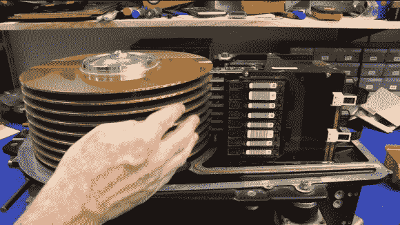

# 价值 25 万美元的硬盘拆卸

> 原文：<https://hackaday.com/2012/12/07/250000-hard-drive-teardown/>

你以前见过这么大的硬盘吗？你当然没有，这个单位的成本远远超出了你的工资级别。但是现在它已经有几十年的历史了，我们有机会在这个庞然大物里四处张贴。[达夫·琼斯]——我们已经很久没见到他了—[看看这个价值 25 万美元的存储设备](http://www.eevblog.com/forum/blog/eevblog-395-world's-most-expensive-hard-drive-teardown)。

在本期的 EEVblog 中,[Dave]正在拆除一个 20 世纪 80 年代后期的 IBM 硬盘。这是 IBM 3390。它的存储容量为 1.78GB 或 3.78GB。如今，我们再也不会使用机械驱动器来存储这么小的容量，因为闪存要便宜得多。但这是当时服务器的前沿。这就是为什么你会花 25 万美元买这个东西。

[Dave]休息之后做他在视频中所熟知的事情。他精力充沛地讨论硬件的每个方面，一边讨论功能和设计选择。

[https://www.youtube.com/embed/CBjoWMA5d84?version=3&rel=1&showsearch=0&showinfo=1&iv_load_policy=1&fs=1&hl=en-US&autohide=2&wmode=transparent](https://www.youtube.com/embed/CBjoWMA5d84?version=3&rel=1&showsearch=0&showinfo=1&iv_load_policy=1&fs=1&hl=en-US&autohide=2&wmode=transparent)