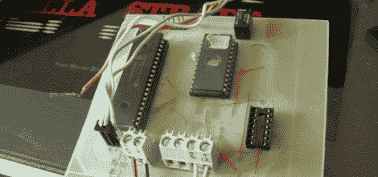

# 2708 EPROM 转储器

> 原文：<https://hackaday.com/2012/09/10/2708-eprom-dumper/>

[Andrea "Mancausoft" Milazzo]一直在修复通常包含 EPROM 芯片的旧设备。他以为自己已经准备好了一个 EPROM 阅读器，可以轻松地从 2716 芯片和其他几个芯片中读取数据。但是他发现硬件无法读取 2708 和 2704 芯片。他的解决方案是[建立一个基于 PIC 的 EPROM 转储器](http://museo.freaknet.org/en/eprom-2708/)。

你可能还记得[我们最近的一些功能](http://hackaday.com/2012/06/26/taking-a-dump-from-some-old-hardware/)这些芯片是一个滴答作响的时钟。它们存储程序代码和其他对旧硬件运行至关重要的信息。由于它们是用紫外光擦除的，多年暴露在环境光下会破坏一些数据。

读取这种芯片所需的规格相当简单。有十个地址引脚和八个数据引脚。[Andrea]还需要一种方法将数据从微控制器传输到计算机进行备份。为此，他又使用了两个引脚，使 I/O 数达到 20。他使用 PIC 18F4610，并围绕它构建了其余的阅读器。