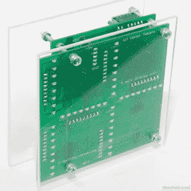

# 带 LED 条形显示屏的 3 轴加速度计

> 原文：<https://hackaday.com/2012/04/25/3-axis-accelerometer-with-led-bar-displays/>

[维克多]不记得他为什么开始这个项目。他不知道自己最初的想法是什么，也不知道预期的用途是什么。他知道他想要一个与蓝色发光二极管互动的东西。他最终得到的是一个 [3 轴加速度计，它有一个非常酷的显示屏](http://diy.viktak.com/2012/04/pic-based-3-axis-accelerometer.html)，放在他的桌子上让参观者开心。

使用 PIC16F887 作为大脑和飞思卡尔 MM7361 三轴加速度计构建，您可以从他的网站上获取原理图。代码也可以按需获得。

[via [HackedGadgets](http://hackedgadgets.com/2012/04/24/3-axis-accelerometer-based-on-the-freescale-mma7361l/)

[https://www.youtube.com/embed/Cgmy_fSlciM?version=3&rel=1&showsearch=0&showinfo=1&iv_load_policy=1&fs=1&hl=en-US&autohide=2&wmode=transparent](https://www.youtube.com/embed/Cgmy_fSlciM?version=3&rel=1&showsearch=0&showinfo=1&iv_load_policy=1&fs=1&hl=en-US&autohide=2&wmode=transparent)