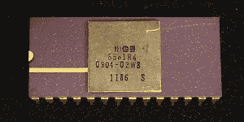
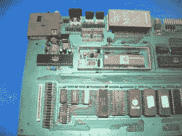
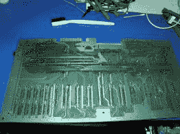
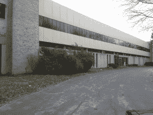
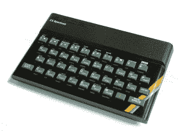
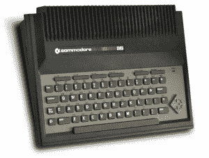
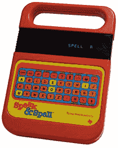

# 30 年后，特德发现他的声音:准将的故事第一部分

> 原文：<https://hackaday.com/2014/09/02/30-years-later-ted-finds-his-voice-a-commodore-story-part-i/>

MOS SID Chip Sound Interface Device

在以前(我在这里说的是 20 世纪 80 年代)，当家用电脑被认为是消费品时，有 C64 准将。C64 从两个集成电路(IC)中获得了大量的超能力，这两个集成电路分别代表视频接口芯片和声音接口设备。芯片的名字是我们文化的一部分，从维克到胖阿格尼斯。

我们谈论维克和希德，就好像他们是普通人或远亲，有时脾气不好或容易突然爆发，但对芯片和制造芯片的工程师总是有一种潜在的尊重。维克和希德一起创造了世界上最好的视频和声音体验；运动和噪音，音符和外星人。

作为一名年轻的新晋工程师，我在 MOS 芯片制造厂楼上的办公室为 Commodore 工作，这是我工作的第二周，这时工程主管和我的老板[Shiraz Shivji]把我拉进了他的办公室。这是喧嚣的两个星期，想象不到的技术无处不在，当人们在大厅里漫步时，它们从办公室中溢出。每两个门口就有一个在玩电子游戏，这让人不禁想知道有多少人在工作，有多少人在偷懒，又有多少人在同时做这两件事。

  Rare Commodore C-364 Top Right PCB  Rare Commodore C-364 Top Left PCB  Rare Commodore C-364 Bottom PCB Jumpers partial due to make Magic Voice desktop app speak.

在那短暂的时间里，我已经开始了我自己的旋风式的值勤之旅。在我为 Commodore 工作 25 年后，我通过阅读[Brain Bagnal]的书*在边缘*发现我只是作为一个低级技术员被雇用。我第一天就被提升为程序员，代替一个外出度假的程序员。他们让我和另外两个人坐在一间小办公室的椅子上。所有的办公室最多容纳三个人；如果我们可以省去门，我们无疑会在同一个空间里塞满四个。

这间办公室不同于任何其他办公室。这间办公室收藏了大量的蜘蛛植物。我感到很幸运能在 Commodore 工作，尤其是坐在唯一一间有绿色植物的办公室里。

Standing Silent: Former MOS Semiconductor in King Of Prussia PA

我没有完成任何软件任务，我真的不能坐在椅子上，我一直呆在硬件实验室里。第一周的星期五，我成了当时我们称之为“飞车”的受害者。工程主管在大厅里从我身边经过，他拦住了我的四人小组，想谈谈芯片产量。不知何故，在那个特殊的时刻，我被挑选出来代表 R&D 工程部。

我一定做得很好，我相信下次我会分享完整的故事。简而言之，我解决了一个问题，而不仅仅是避免了指责。下一次我被拉进(设拉子的)办公室时，感觉又是一次路过。我全神贯注地坐下来，为我的新使命做好准备。我在训练和经验上的不足，我会努力用充沛的精力来弥补。

ZX Spectrum

[Shiraz]打开了一个 Commodore 制造的文件柜(你以为我们只是制造电脑)，给我看了一份 Timex/Sinclair 光谱。它就在我这边的桌子上。竞争对手，那些偷我们午餐钱来养活自己的人。敌人。

Commodore C116 – 1980 Computer

那一刻，我被安排负责最新的电脑，这无疑是对我一直呆在硬件实验室的惩罚。我被介绍给 TED，文本显示芯片，我们最新的单芯片计算机系统。我没有提到我们以前见过面，担心说错话会让我像刚加入时一样很快被踢出这个项目。

围绕特德准将一家的更多对话和问题可以在我几年前制作的视频中看到。

撇开标准的故事不谈，今年发生了一些事情，我发现了一个罕见版本的 TED 机器，并把它带到了 VCF。这个 TED 与众不同，它可以和你说话。

Texas Instruments TI Speak and Spell from the 1980’s

这要追溯到只有一种设备会说话的时代，TI 会说话和拼写。所以很自然的，准将去雇佣，或者偷，也许是强迫，非常有工程天赋的人来说话和拼写他的声音。现在泰德会用那种声音说话，我仍然记得那天泰德清了清嗓子说话，他念错了几个单词，但那是一个非常奇妙的时刻，至少是在我的生命中。

泰德说了什么？那是另外一个故事了。继续阅读我的故事第二部分。

【MOS 建筑图片由 Fran Blanche 提供】
【C64 主板图片由 Bill Bertram 提供】