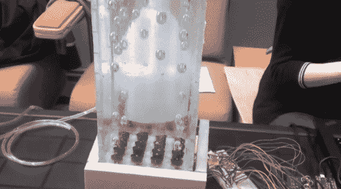

# 3D 气泡显示

> 原文：<https://hackaday.com/2014/01/09/3d-bubble-display/>

西北大学机电一体化研究生克雷格·舒尔茨(Craig Shultz)从去年冬天给我们发来了他的团队项目的视频:[一个 3D 气泡显示器](http://www.youtube.com/watch?v=DKK-M6_tfdM)。我们已经在这里看到了一些令人印象深刻的创新气泡展示——最近的是 [60 管 RGB LED 建筑](http://hackaday.com/2013/09/10/an-improved-bubble-display-with-rbg-leds/)——但【克雷格的】是我们看到的第一个为项目增加一些深度的展示。

在很大程度上，它的结构是你所期望的:一个丙烯酸外壳，里面有 4×4 的管子，16 个阀门，16 个独立控制的螺线管，和一些小气泵；全部由 PIC 微控制器驱动。然而，在视频中，如果你想看到这些管子，你必须睁大眼睛，这是[克雷格]展示展示深度的一个聪明的设计选择。通过将甘油与具有相似折射率、Pyrex 的管材配对，每个气泡被视觉分离。结果，管子无缝地融入流体中。休息之后请看视频。

[https://www.youtube.com/embed/DKK-M6_tfdM?version=3&rel=1&showsearch=0&showinfo=1&iv_load_policy=1&fs=1&hl=en-US&autohide=2&wmode=transparent](https://www.youtube.com/embed/DKK-M6_tfdM?version=3&rel=1&showsearch=0&showinfo=1&iv_load_policy=1&fs=1&hl=en-US&autohide=2&wmode=transparent)