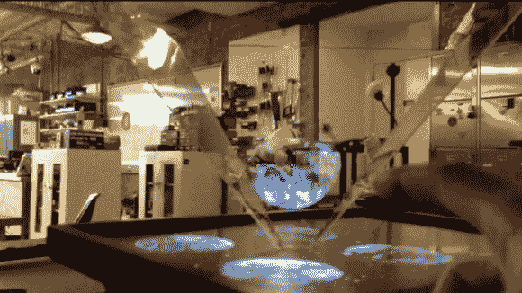

# 通过跳跃动作控制的 3D 显示

> 原文：<https://hackaday.com/2013/03/09/3d-display-controlled-with-the-leap-motion/>

触摸屏很好——我们仍然离不开键盘，但在旅途中它们已经足够了。但是越来越明显的是，用户界面技术的最终目标是完全消除为了与硬件交互而触摸它的需要。实现这一目标的一个途径是通过 Siri 等软件使用语音命令，但另一个途径是使用 Kinect 或 Leap Motion 等 3D 处理硬件。该项目使用后者[来控制 3D 显示器](http://robbietilton.com/blog/?p=1589)上显示的图像。

[Robbie Tilton]使用 JavaScript 3D 库 [Three.js](https://github.com/mrdoob/three.js/) 生成了一个 3D 图像。使用丙烯酸金字塔将光线反射到观众的眼睛，而不遮挡房间的环境光，使图像看起来好像漂浮在空气中。过去我们称之为[立体显示器](http://hackaday.com/2011/01/18/glimpses-of-a-3d-volumetric-display/)。但是[Robbie]指出这实际上使用了一种叫做[佩珀的鬼魂](http://en.wikipedia.org/wiki/Pepper%27s_ghost)的幻觉。它不是真正的体积，因为深度只是一种错觉。移动你的观点不会改变你的视角，除非你走到拐角处的下一块亚克力。不过还是不错的效果。跳完之后在演示中自己看吧。

[https://player.vimeo.com/video/59377788](https://player.vimeo.com/video/59377788)

[via [Dvice](http://www.dvice.com/2013-3-7/manipulable-3d-hologram-created-leap-motion)