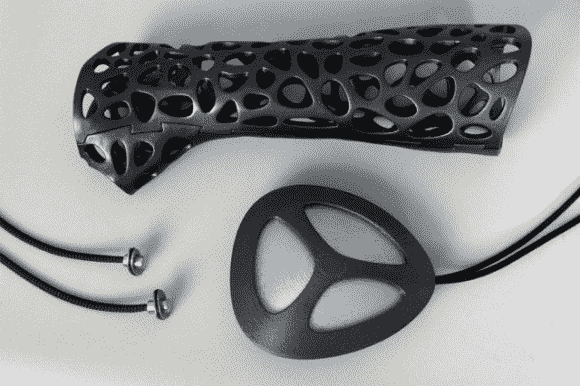

# 带有超声波发射器的 3D 打印铸件承诺更快的愈合时间

> 原文：<https://hackaday.com/2014/05/06/3d-printed-cast-with-ultrasound-emitter-promises-faster-healing-times/>

大约一年前，[杰克·艾维尔]在阻止他的朋友和另一个人打架时伤了手。在接下来的几周里，他意识到陈旧的石膏模型实在是太笨重、太臭、太痒，除了让你的手臂完全固定不动之外，并不完全有助于愈合。就在那时，他想出了[皮质石膏](http://www.wired.co.uk/news/archive/2013-07/05/3d-printed-cast)——一种 3D 打印的外骨骼石膏，可以提供支撑，让你的手臂呼吸，甚至可以弄湿！

快进到今天，另一个设计师正在玩 3D 打印模型——但那些[可能会加快愈合时间！](http://arstechnica.com/business/2014/05/3d-printed-ultrasound-cast-could-save-us-costly-surgeries/)土耳其设计师【Deniz Karasahin】听说了一种被称为 [Exogen](http://www.exogen.com/) 的系统，这是一种低强度超声波系统，可以帮助加快骨骼修复，有时速度高达 38%。问题？它对常规的石膏模不太有效，因为传感器需要接触皮肤——解决方案？当然是 3D 打印的演员阵容！

你看，超声波技术已经存在 20 多年了，但从未真正被主流使用，因为实际使用它的困难，直到现在。

更好的是，他们还希望很快在美国推出试验——3D 打印机只适用于小饰品和小摆设？Pfft。

【谢谢威廉！]