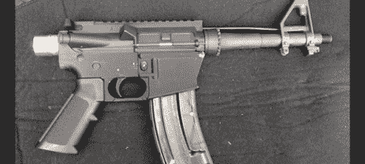

# 3D 打印枪，法律法规，打印物本质的哲学讨论

> 原文：<https://hackaday.com/2012/08/26/3d-printed-guns-laws-and-regulations-and-philosophical-discussions-on-the-nature-of-printed-objects/>

长久以来，3D 打印机一直被视为通向新经济的道路、分布式制造的方法以及当前消费文化的一场革命。每一次革命，都有一些人需要愤怒，国防分布式的家伙们正在尽自己的一份力量让这一切发生。他们正在设计一种能够在业余爱好者级别的 3D 打印机上打印的手枪

这不是我们第一次看到 3D 打印武器；[这个 3D 打印的 AR-15 下部接收器](http://defensedistributed.com/)是 AR-15 唯一包含 ID 标记和序列号的部分。从法律上来说，AR lower *是*枪，需要背景调查才能购买(脚注是，这因州和国家而异——长话短说，BATFE 可能不喜欢 3D 打印的 AR lower)。3D 打印的 AR-15 枪的一个缺点是，枪的每个其他部分都必须从别处购买。这就是 Defense Distributed 的用武之地:他们提议设计一种可以在霍布斯式 3D 打印机(如 RepRap 或 Makerbot)上 100%打印的枪。

现在，国防分布式正在寻找资金来生产两种枪的设计。第一个设计，WikiWep A 将作为一个研究建造，允许 Defense Distributed 回答一些关于 RepRap 可以建造什么的问题。 [WikiWep B](http://defensedistributed.com/wikiwep-b/) 将有用于发射动作的移动部件，几乎所有的部件都可以在 RepRap 或 Makerbot 上打印。

在 Defense Distributed 为他们现已取消的 IndieGoGo 活动发布的视频中(休息后可用)，这些人谈到完全 3D 可打印武器的 CAD 文件的分发是法律法规不再适用的新经济的门槛。我们不确定我们是否同意这种说法；毕竟，任何人只要有一些金属成型工具，就可以制造出一件极好的武器来获得另一件武器，但我们很想知道政府和监管机构会对国防分布式公司的项目做些什么。

[https://www.youtube.com/embed/AQ6Q3BfbVBU?version=3&rel=1&showsearch=0&showinfo=1&iv_load_policy=1&fs=1&hl=en-US&autohide=2&wmode=transparent](https://www.youtube.com/embed/AQ6Q3BfbVBU?version=3&rel=1&showsearch=0&showinfo=1&iv_load_policy=1&fs=1&hl=en-US&autohide=2&wmode=transparent)