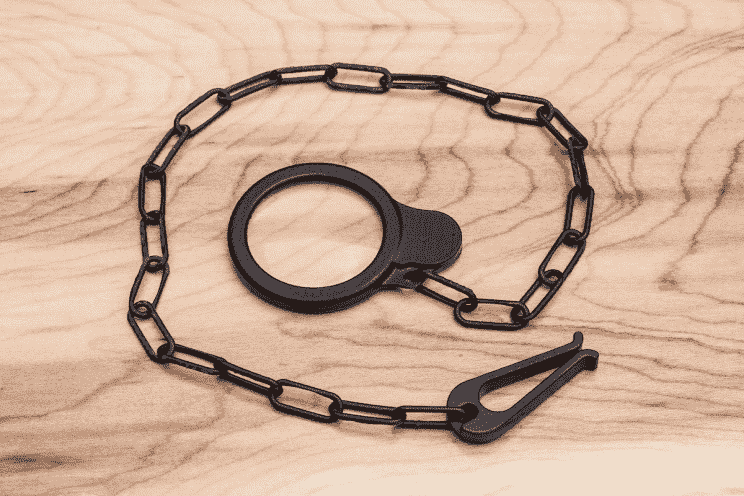

# 3D 打印镜片开启了可能性

> 原文：<https://hackaday.com/2014/12/13/3d-printed-lenses-open-up-possibilities/>

这是一些非常酷的东西。FormLabs 的人决定做一个小实验来测试他们透明树脂的光学透明度。非常清楚。

使用他们自己的切片软件，[预成型](http://formlabs.com/en/products/preform/)，【Craig Broady】按照一个方向打印镜片，使镜片周围的树脂流动最大化，以帮助防止缺陷，尽可能保持光滑。虽然印刷部分看起来非常清晰，但所有镜片都需要某种形式的抛光才能变得光学清晰。它是以 50 微米的分辨率打印的，克雷格使用电钻将镜头从 220 粒度打磨到 2000 粒度的砂纸。

一旦非常光滑，他就改用抛光剂，用一块软木板旋转镜头。他用 Novus 刮痕去除剂来做这个。一旦明确了他的喜好，他就在另一边重复整个过程。然后，他将它放入 3D 打印的单片眼镜、链条和吊杆中——一个完全 3D 打印的单片眼镜。

SLA 打印机很贵，但是想象一下可能性——自己做眼镜！

【谢谢詹妮弗！]