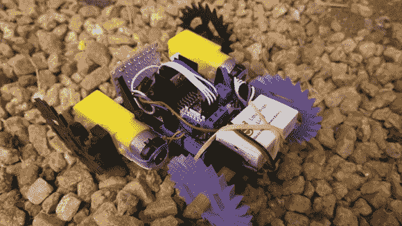

# 3D 打印网络遥控汽车

> 原文：<https://hackaday.com/2014/01/28/3d-printed-netduino-remote-controlled-car/>

[Matt]住在南非，那里的房子有很小的爬行空间(有些只有 30 厘米高！)让他无法挤进去。即使他能，他可能也不会:它们显然是当地老鼠的度假屋。然而，他确实想探索这些空间，以更好地了解内部发生的事情，所以他[用 Netduino 和 3D 打印的零件建造了一辆 Windows Phone 控制的汽车。](http://blog.roguecode.co.za/Windows-Phone-controlled-car-with-Netduino-and-Bluetooth?)

这种专门的应用需要独特的零件，所以[Matt]从头开始设计和 3D 打印车轮和框架。你可能已经注意到轮子不是你通常所见的圆柱体。Matt 面对的地形是沙子，所以尖刺形状提供了更好的抓地力。该机构的设计需要额外的关注，因为它拥有电机，网络，电机驱动器和电池。

一个蓝牙模块连接到 Netduino，并允许[Matt]用他的 Windows Phone 驾驶汽车，一个便宜的 5V LED 板为那些黑暗的角落提供一些照明。它是如何进入爬行空间的？看起来[Matt]已经到了那一步。他的计划是简单地安装第二台运行 Skype 的手机，然后观看视频流。休息后留下来看[Matt]用这辆车迷惑和刺激他的狗。

[https://www.youtube.com/embed/mgh56WbrzTI?version=3&rel=1&showsearch=0&showinfo=1&iv_load_policy=1&fs=1&hl=en-US&autohide=2&wmode=transparent](https://www.youtube.com/embed/mgh56WbrzTI?version=3&rel=1&showsearch=0&showinfo=1&iv_load_policy=1&fs=1&hl=en-US&autohide=2&wmode=transparent)

[via [reddit](http://www.reddit.com/r/3Dprinting/comments/1w7ujq/3d_printed_windows_phone_controlled_car_with/)