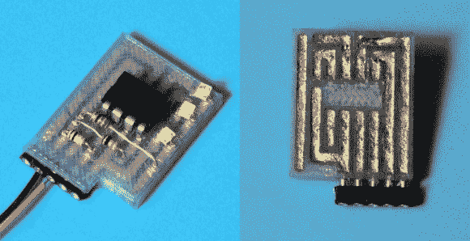

# 3D 印刷、无焊电路

> 原文：<https://hackaday.com/2013/12/13/3d-printed-solderless-circuits/>

如果你正在寻找另一种方法来代替蚀刻你自己的印刷电路板，那么看看这个新的关于 3D 打印测试电路的[指令吧！](http://www.instructables.com/id/3D-Printing-3D-Print-A-Solderless-Circuit-Board/)

[Mikey]当他需要一个小型电路板原型时，他决定尝试这种方法。他设计了一个标准厚度的穿孔板，只有 1/16 厚(~ 1.6 毫米)，一边是薄的凹陷通道，另一边是通孔。[Mikey 的]电路板可以让你把你的元件塞进去，用一条胶带压住，然后用某种导电材料填充通道。在这个例子中，他使用了高导电涂料。

这种 3D 打印选项可能不会满足你所有的电路构建需求，但它可以为你的下一次破解提供一个极好的捷径！和往常一样，休息后会有一段视频。

[https://www.youtube.com/embed/vQuPP3--fxk?version=3&rel=1&showsearch=0&showinfo=1&iv_load_policy=1&fs=1&hl=en-US&autohide=2&wmode=transparent](https://www.youtube.com/embed/vQuPP3--fxk?version=3&rel=1&showsearch=0&showinfo=1&iv_load_policy=1&fs=1&hl=en-US&autohide=2&wmode=transparent)

与在普通喷墨打印机 上打印你的[PCB 不同，购买一台](http://hackaday.com/2013/12/05/instant-inkjet-circuits-with-silver-nanoparticle-ink/) [Kickstarter 机器人 PCB 打印机](http://hackaday.com/2013/11/12/printing-printed-circuit-boards/) ， [蚀刻你自己的](http://hackaday.com/2013/03/04/frans-pcb-etching-techniques/) ，或 [修改你的 3D 打印机以挤出焊料，](http://hackaday.com/2009/04/19/printing-circuits-on-the-reprap/) 这种方法可能是你可以使用的最简单的方法——假设你有制作 3D 模型的技能并能使用 3D 打印机……

【谢谢巴里！]