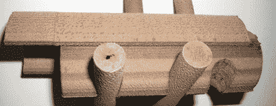

# 木质 3d 打印机灯丝

> 原文：<https://hackaday.com/2012/09/21/3d-printer-filament-made-of-wood/>

信不信由你，你现在可以通过 3D 打印机的喷嘴挤压木头。

制造商的 3D 打印机细丝调色板中的这一新成员来自[Kai Parthy]的想法。这种名为 Laywood 的新细丝是回收木纤维和聚合物粘合剂的混合物，可以像任何其他 3D 打印机细丝一样熔化和挤压。

用 Laywood 印刷的零件与用 PLA 长丝印刷的零件具有大致相同的性质。这种材料的一个有趣的特点是能够添加“树木年轮”，或从浓郁的棕色到非常漂亮的米色的微妙颜色渐变。通过将打印机热端的温度设置为 180°C(浅色)和 230°C(深色),可以随时更改颜色。

从 Laywood 细丝被推进打印机的“活动”视频来看，这种新的木质细丝与任何其他 PLA 或 ABS 塑料一样工作。

在易贝之外，似乎只有一个地方可以买到这种灯丝。这并不便宜，大约每半公斤€16/20 美元，但希望当它变得更受欢迎时，价格会下降。

休息后的视频。

[https://www.youtube.com/embed/8pZyrb_FA8U?version=3&rel=1&showsearch=0&showinfo=1&iv_load_policy=1&fs=1&hl=en-US&autohide=2&wmode=transparent](https://www.youtube.com/embed/8pZyrb_FA8U?version=3&rel=1&showsearch=0&showinfo=1&iv_load_policy=1&fs=1&hl=en-US&autohide=2&wmode=transparent)