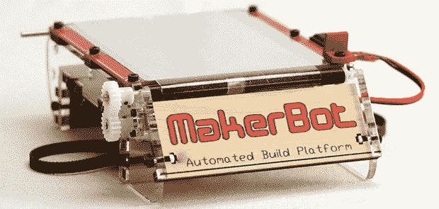

# 3D 打印:呼唤开源自动化构建平台

> 原文：<https://hackaday.com/2013/10/23/3d-printering-a-call-for-an-open-source-automated-build-platform/>

我以前说过，现在我要再说一遍:如果你用 3D 打印机制造几百个相同的塑料零件，那你就错了。这是注射成型或树脂铸造等传统制造方法的用武之地。然而，如果你正在考虑打印几十个相同的塑料零件，或者甚至运行一个脚本来优化你的机器时间，当前开源 3D 打印机世界还有一件事需要改进。

#### 自动化构建平台

自动化构建平台是一个相当简单的想法:在你的加热床上放一条传送带，当打印完成后，发送命令驱动电机，将新打印的部分倒入垃圾箱，打印机然后在干净的床上开始下一部分，沉迷于 3D 打印机的日子很快成为过去。

对于这样一个简单而有用的想法，令人惊讶的是，在开源圈子里，这个想法并没有得到太多的应用。当然，技术和法律方面都有问题，但希望没有什么会无限期地阻碍任何想要创建第一个开源自动化构建平台的人。

#### 问题空间

对于那些已经关注 3D 打印机一段时间的人来说，自动化构建平台的想法听起来非常熟悉。Makerbot 为他们的第一代 3D 打印机——纸杯蛋糕卖出了一台。从那时起，它就被从 Makerbot 商店里拿走了，显然也从所有 Makerbot 文学作品中删除了；甚至自动构建板的 [Makerbot Wiki 页面也被删除了。这并不意味着你仍然不能](http://wiki.makerbot.com/abpv1)[购买 ABP](http://reprap.me/MakerBot-Automated-Build-Platform-Lasercut-Parts) 的零件，你只是没有得到 Makerbot 的任何支持或文件。

“但是 Makerbot 太可怕了，还有其他人身攻击！”你会说，但是我们不要忘记早期的 Makerbot 实际上是非常创新的。他们在其他人之前[想出了一个伟大的 paster struder](http://hackaday.com/2013/10/16/3d-printering-pastestruders/)，并创建了 ABP [来制造他们自己的印刷零件](http://www.youtube.com/watch?v=A42IeYAVtkU)。仅仅因为一台机器上有 Makerbot 的标志并不意味着它就一定是坏的…

#### 这只是意味着它自动获得专利

是的，自动构建平台有两项专利，显然是[一项是设备](https://www.google.com/patents/US8282380?dq=inassignee:%22Makerbot+Industries%22&ei=Ht5nUoTKF87wkQe5mYCYBg)和[一项是方法](https://www.google.com/patents/US8287794?dq=inassignee:%22Makerbot+Industries%22&hl=en&sa=X&ei=Ht5nUoTKF87wkQe5mYCYBg&ved=0CFoQ6AEwBQ)。不管你怎么称呼它，但是一个发明家应该从他们的发明中获利。总部基地是一个伟大的想法，我们更愿意看到它现在在野外。然而，这种思路有一个问题:没有人从 Makerbot 自动构建板中获利。Makerbot 不卖这个。这给我们留下了另一个选择。

#### 我们会建立自己的总部。玩 21 点。

哦，黑客读者，这是对你的一个挑战。3D 打印机的世界已经很大程度上建立在一个单一的构建平台上。如果我对这个 3D 打印专栏的建议理解正确的话，有一个对开源自动化构建板的需求。让我们实现它。

在尝试建立自己的总部之前，有一些事情需要考虑。其中最重要的是柔性床材料。根据专利，Makerbot ABP 使用厚度在千分之三到千分之七英寸之间的聚酯薄膜或 kapton 材料。接下来是从床上取下成品的方法。这可以通过传送带或分配每次构建消耗的单张材料来完成。所有这些都在专利中，令人惊讶的是他们几乎什么都想到了..

是的，Makerbot ABP 受到几项专利的限制，但请将此视为另一项有趣的工程挑战。正如[匡威全明星不像运动鞋一样被征税](http://blogs.smithsonianmag.com/smartnews/2013/09/this-is-why-your-converse-sneakers-have-felt-on-the-bottom/)一样，开源自动化构建板的目标是创造不侵犯 Makerbot 专利的东西。设计一些东西，放在 Thingiverse 上，然后发到 Hackaday tips 热线。我们会把它挂起来。