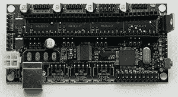
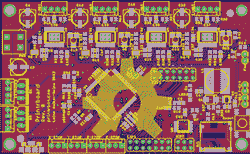

# 3D 打印:电子板

> 原文：<https://hackaday.com/2013/09/06/3d-printering-electronics-boards/>

如果你正准备建造一台 3D 打印机，你首先需要考虑的事情之一就是你对电子板的选择。无论您决定优化成本还是性能，您在构建的规划阶段所做的选择都会极大地影响最终项目的外观和行为。

有一吨的电子板在那里，所以对于这个安装的 3D 打印，我们要看看有什么可用的。点击下面的链接~~给 Hackaday 更多的浏览量~~阅读其余内容。

#### 坡道、伦巴和兰博

RAMPS，RepRap Arduino Mega Pololu Shield，是 OG RepRap 电子板。电路板本身相当简单——几个用于 Pololu 步进电机驱动器的插座，几个用于加热器和风扇的 MOSFETs，以及几个连接电源的螺丝端子。

由于这是一个盾牌，该板的所有智能都来自 Arduino Mega。虽然与其他电子板相比，库存设置非常少，但可以通过一个附加的 [SD 卡](http://reprap.org/wiki/Sdramps)或[控制面板](http://reprap.org/wiki/RAMPS_1.3/1.4_GADGETS3D_Shield_with_Panel)来扩展斜坡，使您可以在没有计算机的情况下操作 3D 打印机

[RAMBo](http://reprap.org/wiki/RAMBo) 是 RAMPS 的衍生产品，其主要区别在于，包括微控制器在内的一切都在一块电路板上。这是一个简单的解决方案，但也有焊接步进驱动器的问题。如果这些芯片烧坏了…好吧，你最好有一个好的焊料芯。

[RUMBA](http://reprap.org/wiki/RUMBA) 摆脱了集成步进驱动器的问题，但仍然保持了 RAMBo 的“一切在一块板上”的思想。像 RAMBo 一样，它具有用于 X，Y，Z 的五个电机驱动器和两个挤出机，可以处理 SD 卡和控制面板。

#### 血清素及其衍生物

这种几乎无法发音的板通过将所有东西放在一个板上，废除了 Arduino Mega+Shield RAMPS 范例。基于基于 ATMega644P 的 Arduino 克隆体 [Sanguino](http://sanguino.cc/) ，Sanguino olu 与 Arduino Mega + RAMPS 组合相比，在闪存和 RAM 方面显得*有点不足，但目前带有 ATMega1284P 的 Sanguino olu 的 1.3b 版本给了它足够的空间来运行你可能需要的任何固件。*

与斜坡和大多数其他电子设备一样，Sanguinololu 使用 [Pololu 步进电机驱动器](http://www.pololu.com/catalog/product/1182)，在一个驱动器烧坏的情况下，可以轻松更换。尽管微控制器相当有限，但配有 ATMega1284P 的 Sanguinololu 能够利用[sd 卡适配器](http://reprap.org/wiki/SDSL)和[LCD 控制面板](http://reprap.org/wiki/Panelolu)。

血清素的流行催生了一些衍生品。其中之一是 [Teensylu](http://reprap.org/wiki/Teensylu) ，基于 Atmel AT90USB1286 芯片，以摆脱在 Sanguinololu 上找到的 FTDI 串行芯片。除此之外，这两块板还是比较有可比性的。

就像开放硬件中的所有事情一样，总会有更好的解决方案。当 Printrbot 团队为他们异常受欢迎的打印机寻找电子板时，他们转向 Teensylu 作为他们 [Printrboard](http://reprap.org/wiki/Printrboard) 的灵感。

像 Teensylu 一样，由于其 AT90USB1286 微控制器，Printrboard 不需要 FTDI 芯片，它还包括一个集成的 SD 卡插槽，与 Teensylu 不同，[可以与 Panelolu 控制面板](http://blog.think3dprint3d.com/2012/07/panelolu-with-printrboard.html)一起工作。尽管有些人对 Printrbot 有所评论，但 Printrboard 是一个*真正*好的套件，唯一(可能是想象中的)缺点是焊接的步进驱动器。

#### DIY 解决方案怎么样？

RepRap 项目最初是为了设计一台自我复制的机器而创建的。由于担心灰色粘性场景和在 Kickstarter 上销售后稀缺社会中真正无处不在的设备的经济现实，这种想法已经慢慢消失了。电子产品已经取得了长足的进步，可以在笛卡尔机器人平台上在家制造，最新的进展是[【Traumflug】的第 7 代电子板](https://github.com/Traumflug/Generation_7_Electronics)

Gen 7 板是 DIY 电子板的终极产品。就功能而言，它非常接近 Sanguinololu——不是最好的，但比驱动 3D 打印机的能力更强。这块电路板真的是一件艺术品，如果你的黑客空间里有人真的擅长制作 PCB，你可能会想请他们举办一个以 Gen 7 电子产品为特色的研讨会。

#### 其他板块

以上板卡使用 AVR 微控制器。虽然他们为他们想要做的事情而工作，但是有一些限制。圆弧和圆对编程来说有点奇怪，将这些板用于笛卡尔 3D 打印机以外的东西——例如 CNC 机器或激光切割机——有点不寻常。[奶昔板](http://smoothieware.org/)就是这些问题的解决方案。

思慕雪由 ARM Cortex M3 驱动，比上面相当强大的主板提供了更多的计算能力。这对于非传统的 3D 打印机来说是一个福音，比如 SCARA 武器公司、Delta bot 打印机和我们之前见过的 H-bot 打印机。

如果这还不够的话，冰沙还有该死的以太网。还有[一个控制面板](http://smoothieware.org/smoothiepanel)也在工作中，但是[找到一个供应商](http://smoothieware.org/getting-smoothieboard)比它应该的要麻烦一点。

#### 外卖

所有这些主板都有各自的优缺点，但是尽管差异很大，它们都相当相似，价格也差不多。主要的固件已经被移植到大多数这些板上，并且扩展的功能，例如 SD 卡插槽和控制板，几乎在所有这些板上都可用。

我没有任何资格告诉你哪种板是最好的，但我会说，我可能会淘汰我的 Mendel 上的 Sanguinololu，为我即将到来的 Prusa i3 build 制作一个印刷纸板(如果有人能为我找到一个铝板的美国供应商……)如果你正在计划你的第一个 3D 打印机制造，就把它作为它的价值。

如果你正在寻找一个相当复杂的打印机电子板，你可能要考虑一个斜坡或 RAMBo 板。它有两个挤压机驱动器，如果你想尝试多色或多材料打印。这或多或少是自制 3D 打印机的事实标准。