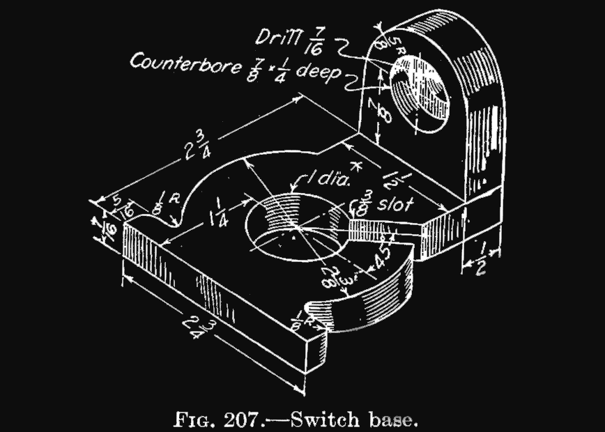
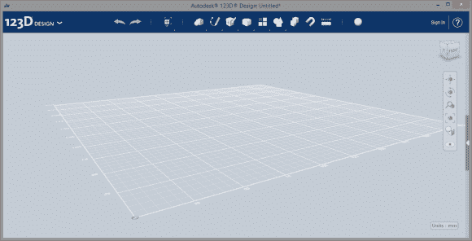
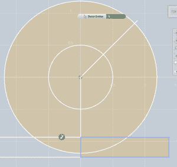
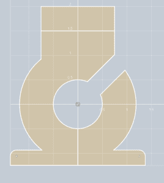
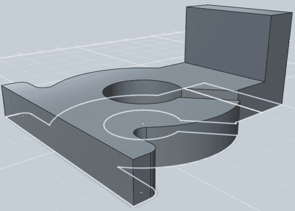
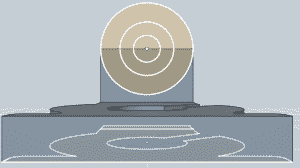
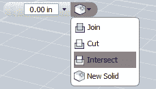
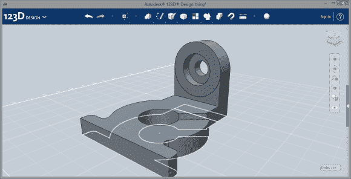

# 3D 打印:在 Autodesk 123D 中制作东西

> 原文：<https://hackaday.com/2014/01/22/3d-printering-making-a-thing-in-autodesk-123d/>

在与专门用于制造塑料八足动物和无用小饰品的 3D 打印机的持续战斗中，这里是制作物品教程的又一部分。如果你曾经想在多个 3D 设计软件中制作一个单一的物体，这是给你的。 **

之前，我们已经在几个不同的 3D 建模程序中构建了一个“东西”，包括:

*   [OpenSCAD](http://hackaday.com/2013/12/11/3d-printering-making-a-thing-with-openscad/)
*   [AutoCAD 第一部分](http://hackaday.com/2013/12/18/3d-printering-making-a-thing-with-autocad/)
*   [AutoCAD 第二部分](http://hackaday.com/2013/12/22/3d-printering-making-a-thing-in-autocad-part-ii/)
*   [搅拌机第一部分](http://hackaday.com/2014/01/03/3d-printering-making-a-thing-in-blender-part-i/)
*   [搅拌机第二部分](http://hackaday.com/2014/01/08/3d-printering-making-a-thing-with-blender-part-ii/)
*   [SketchUp](http://hackaday.com/2014/01/15/3d-printering-making-a-thing-with-sketchup/)

看到下面的“阅读更多…”链接了吗？你可能想点那个。

#### 我们的事

 像所有这些制作东西的教程一样，我们用这个开关底座，从一本 85 年前的工程制图教科书上撕下来的。

感谢我是个白痴，我们没有制作这个开关底座的*精确*副本。在右边的图形中，这个开关底座上的垂直凸缘有一个轻微的锥度。虽然我不是一个中途改变这些教程的人，但成品将足够接近。

#### 开始，或者，神圣的废话，这些 123D 产品是怎么回事？

如果你前往 Autodesk 123D 页面，[你会看到 Autodesk 免费建模和设计软件系列中的大量相关产品](http://www.123dapp.com/create)。 [Make](http://www.123dapp.com/make) 应用程序基本上是一个切片器，可以将 3D 对象变成类似于你小时候制作的模切胶合板恐龙模型的东西。 [Catch](http://www.123dapp.com/catch) 将相机变成 3D 扫描仪。Sculpt 是一款 iDevice 应用，它的用处可能远不如它的酷。设计是我们的追求。这是一款功能齐全的 3D 设计软件，允许您为 3D 打印机创建对象。

123D Design 提供 web 应用程序、iDevice 应用程序或 Mac 和 PC 的免费下载。我用的是 PC 版，所以如果你也在跟进的话，[去这里下载你的拷贝](http://www.123dapp.com/design#download)。安装它，你会看到下面的屏幕:

重要的事情先来。因为我们的“东西”是以分数英寸设计的，所以我们需要将 123D 的单位改为英寸。点击右下角的单位按钮。

如果你以前用过 AutoCAD，你会发现 123D 设计的用户界面非常相似。在屏幕的右侧，有用于平移、环绕、缩放和拟合的按钮，就像在 AutoCAD 中一样。此外，右上角是“视图立方体”，允许您旋转窗口，并将其固定到顶部、底部、前部、后部、左侧或右侧视图。双击立方体的顶部，123D 将确定窗口的方向，这样我们可以先制作二维的东西，然后将它们挤压到 Z 维。

#### 制作一件东西

在顶部工具栏，你会看到草图工具。从那里，选择圆，并绘制一个 1 英寸的圆。然后，在同一个圆心上画一个 2 又 3/8 英寸的圆。就像在 AutoCAD 中一样，你可以简单地在键盘上输入一个数字，123D 就会使圆变成那个大小。与 AutoCAD 以及几乎所有其他绘图程序不同，你在 123D 中输入的数字将是直径*，而不是半径。我发现这比输入半径更容易使用，如果有人对 UX 的决定有所了解，我很想听听。*

 *

现在是另一个工具。从“草图”菜单中，选择“多段线”。从圆心开始画两条线，都是 1.25 英寸长，一条 0 度，另一条 135 度。从 0 度线的底部，绘制一个 1 3/8 英寸乘 5/16 英寸的矩形。使用镜像工具，沿着 0 度线镜像这个矩形。

圆角线和修剪线就像在 AutoCAD 中一样工作。在我们刚刚放好的矩形的外角上放一个 1/8”半径的圆角。

#### 现在轮到吃角子老虎了

我们已经有一条线穿过我们的东西上的槽应该去的地方的中心。在草图菜单下，有一个偏移工具。选择偏移工具，单击槽中心线，并将其偏移 3/16”。就像在 AutoCAD 中一样，我们可以使用 Trim 命令来清理一切。添加另一个法兰，你应该有一些看起来像右边的图片。

在顶部工具栏的“修改”选项卡下，选择“拉伸”。将开关底座的主要部分向上拉 7/16 英寸，将另一个奇怪的法兰部分向上拉 21/16 英寸。一旦你进入 3D-land，你可以使用“修改”选项卡下的“圆角”命令来放置内部圆角。只需选择“垫圈”和“宽法兰”零件之间的内角，并将圆角半径设置为 0.125 英寸。现在，您的零件应该看起来像这样:

#### 给它加上一个顶

 点击‘视图立方体’的‘正面’后，在法兰的顶部放一系列同心圆。之后，玩视图立方体，直到你处于某种舒适的等轴测或正交视图中，挤出这些圆，直到你有类似我们的东西。

请注意,“拉伸”工具在输入尺寸位置右侧的下拉菜单中有伪布尔操作。123D 在如何决定将部分挤压到其他部分上有点怪异；我的建议是尝试一下这个选项，直到你得到一些大致正确的东西。

当你完成后，你就有了这个，我们的东西，准备导出到一个。STL 文件并发送到 3D 打印机:

* * *

Autodesk 123D 到此为止。如果您对本教程系列中的下一个软件有什么建议，我洗耳恭听。

我还要感谢[tarasbot]主动提出了 123D 教程，并为此教程撰写了大量的文章。还有，[他做了这个东西！](http://hackaday.com/wp-content/uploads/2014/01/fig13.png)用合适的锥度！*