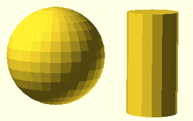
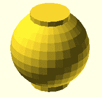
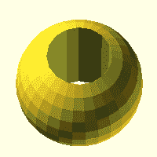
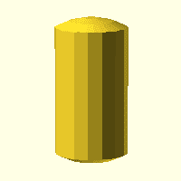
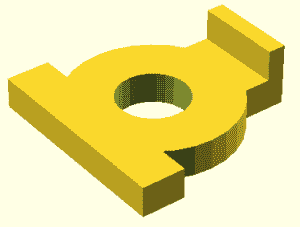
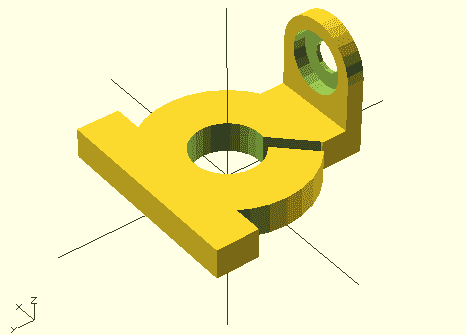

# 3D 打印:用 OpenSCAD 制作一个东西

> 原文：<https://hackaday.com/2013/12/11/3d-printering-making-a-thing-with-openscad/>

本周，我们从 [OpenSCAD](http://www.openscad.org/) 开始，这是一个 3D 建模程序，更像编程而不是绘图。许多有用的 3D 可打印对象——包括许多 RepRaps 的部件——都是在 OpenSCAD 中设计的，因此希望到此结束时，您能够设计自己的部件。

这并不意味着是 OpenSCAD 的完整教程；我只是演示 SCAD 足以建立一个简单的部分。下周我很可能会用 AutoCAD 设计一个零件，但是如果你知道我应该用什么软件工具来制作一个零件，请在评论中留言。查看下面的使用 OpenSCAD 制作零件的 3D 打印指南。

#### 首先，一些基础知识

OpenSCAD 背后的基本思想是[构造性立体几何](http://en.wikipedia.org/wiki/Constructive_solid_geometry)这是一种建模技术，使用基本图元，如球体、立方体或圆柱体，以及基本布尔运算来创建对象。用文字来描述这种技术实在是太可怕了，所以这里有一个非常非常简短的例子。右边是在 OpenSCAD 中创建的两个对象的图片，一个立方体和一个圆柱体。下面是代码，您应该可以很容易地理解:

以前



```
module example() {
     sphere(10);
     translate([15,15,-10]){
          cylinder(h=20, r=5);
     }
}
example();
```

脑死亡很简单，对吧？我们只是在创建一个半径为 10 的球体和一个半径为 5、高度为 20 的圆柱体。我们在空间中将圆柱体在 x 和 y 轴上平移 15 个单位，在 z 轴上向下平移 10 个单位。这就是构造立体几何学的用武之地。我们可以通过使用 union()命令来组合这两个 3D 图元，如下所示:



```
    union(){
       sphere(10);
       translate([0,0,-10]){
          cylinder(h=20, r=5);
       }
    }
```

在 OpenSCAD 中，union 命令是隐式的。大多数时候，你并不需要它，除非你需要结合其他布尔运算。我们还可以使用两种布尔运算——差，或者只是从一个对象中减去另一个对象，以及交集。下面是差异命令:



```
   difference(){
      sphere(10);
      translate([0,0,-10]){
         cylinder(h=20, r=5);
      }
   }
```

和相交命令:



```
   intersection(){
      sphere(10);
      translate([0,0,-10]){
         cylinder(h=20, r=5);
      }
   }
```

这是建设性的立体几何。有了这些布尔运算，你几乎可以做出任何东西。我想是时候展示一下了，是吧？

#### 我们的事

由于我将要做几个关于如何建造一个“东西”的教程，在这些教程中有一个标准的“东西”是有意义的。选择一个对象进行复制出乎意料地困难，但在翻出几本关于工程制图和制图的书后，我选定了上面的'东西'，来自*工程制图*(法语，1929)。如果你想知道为什么我从一本如此古老的书中选择了如此奇怪的东西，请记住:设计阿波罗飞船的人是通过这本书学会制图的。还有，这是我的专栏，处理一下吧。通过组合几个圆柱体和立方体，很容易创建一个非常基本的形状，这将成为我们的成品部分。下面是初始代码，以及一个渲染:



```
module thing()
{
     difference(){
        cylinder(h=7, r=19);
        cylinder(h=7, r=8);
     }

     translate([-23,10,0]){
        cube([46, 10, 7]);
     }

     translate([-10,-26,0]){
        cube([20, 16, 7]);
     }

     translate([-10,-26,7]){
        cube([20,4,7]);
     }
}
thing();
```

再说一遍，这仅仅是我们部分的开始。这里我们只使用立方体和圆柱体。如果你想知道为什么我们使用的尺寸如此奇怪，那是因为原始部分(发表在 1929 年我的第四版*工程图* 副本中，但它可能来自 1911 年出版的第一版)是八分之一英寸。我正在写我的 OpenSCAD，所以一个单位等于八分之一英寸。当我们打印出来的时候，我们可以通过乘法来解决任何大小问题。为了完成我们部分的主体，我们需要在法兰上添加一些圆柱体。OpenSCAD 真正酷的一点是能够创建小部件，然后用 union 命令将它们组合起来。以下是我们法兰的气缸集合:

```
module flange() {
     rotate([270,0,180]){
          translate([-10,6,-4]){
              difference(){
                 union(){
                   cube([20,12,4]);
                   translate([10,0,0]){
                      cylinder(h=4, r=10);
                    }
                 }
                 translate([10,0,0]){
                    cylinder(h=4,r=3.5);
                       rotate([0,0,90]){
                          cylinder(h=3, r=7);
                       }
                 }
             }
         }
     }
}
```

因为 OpenSCAD 基本上只是代码，我们可以简单地在代码中的相关空间调用这个模块。向下滚动几下，您可以在最终的代码中看到这一点。现在我们的部分看起来是这样的:现在唯一要添加的是主体上的 3/8″槽，和一些圆角。我将把圆角作为一个练习留给读者，但这里是生成部分的代码和图片:

```
module thing()
{
   difference(){
      cylinder(h=7, r=19);
      cylinder(h=7, r=8);
      rotate([0,0,225]){
          translate([0,1.5,0]){
             cube([20,3,7]);
          }
      }
   }
   translate([-23,10,0]){
      cube([46, 10, 7]);
   }
   translate([-10,-26,0]){
      cube([20, 10, 7]);
   }
   translate([0,-26,24]){
      flange();
   }
}

module flange() {
     rotate([270,0,180]){
          translate([-10,6,-4]){
              difference(){
                 union(){
                   cube([20,12,4]);
                   translate([10,0,0]){
                      cylinder(h=4, r=10);
                    }
                 }
                 translate([10,0,0]){
                    cylinder(h=4,r=3.5);
                       rotate([0,0,90]){
                          cylinder(h=3, r=7);
                       }
                 }
             }
         }
     }
}

thing();
```



* * *

所以你走吧。一个东西，用 OpenSCAD 创建的。这是用 OpenSCAD 设计东西的权威指南吗？不，但是它足够让你弄湿你的脚。这就足够了，这样你就可以设计自己的零件，并把它们发送到 3D 打印机上。下周，我将在 AutoCAD 中制作相同的零件，这应该可以很好地翻译成其他 CAD 软件包。如果你希望看到用另一个 3D 设计包制作的零件，请在评论中留言。