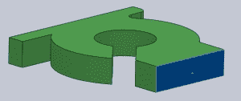
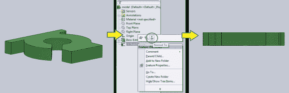
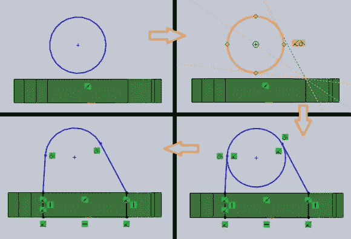
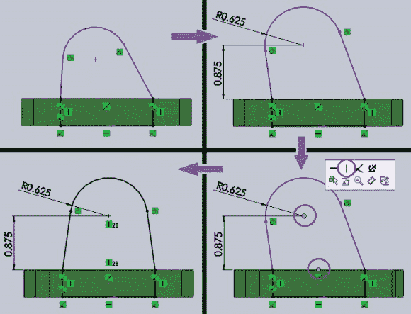
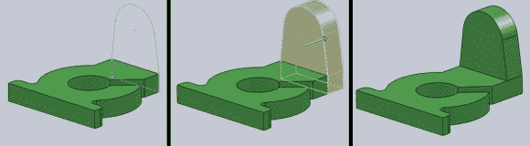
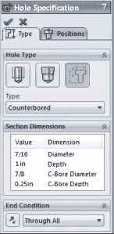
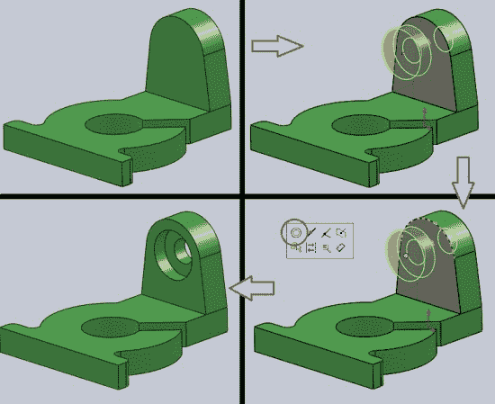
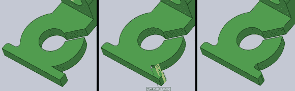
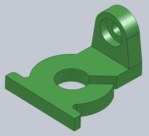

# 3D 打印:用 Solidworks 制作一个东西，第二部分

> 原文：<https://hackaday.com/2014/02/26/3d-printering-making-a-thing-with-solidworks-part-ii/>

上周我们开始用 Solidworks 制作一个东西。我们已经画出了草图并挤出了底座。本周我们将制作背面部分。我们将使用第一部分中的一些相同技术和一些新功能，如 3D 圆角和孔向导。

正如你所知道的，这不是第一个“制造东西”的教程。如果您错过了它们，之前在 3D 打印系列中介绍的软件有:

*   [OpenSCAD](http://hackaday.com/2013/12/11/3d-printering-making-a-thing-with-openscad/)
*   [AutoCAD 第一部分](http://hackaday.com/2013/12/18/3d-printering-making-a-thing-with-autocad/)
*   [AutoCAD 第二部分](http://hackaday.com/2013/12/22/3d-printering-making-a-thing-in-autocad-part-ii/)
*   [搅拌机第一部分](http://hackaday.com/2014/01/03/3d-printering-making-a-thing-in-blender-part-i/)
*   [搅拌机第二部分](http://hackaday.com/2014/01/08/3d-printering-making-a-thing-with-blender-part-ii/)
*   [SketchUp](http://hackaday.com/2014/01/15/3d-printering-making-a-thing-with-sketchup/)
*   [Autodesk 123D](http://hackaday.com/2014/01/22/3d-printering-making-a-thing-in-autodesk-123d/)
*   [自由 CAD 第一部分](http://hackaday.com/2014/02/05/3d-printering-making-a-thing-in-freecad-part-i/)
*   [自由 CAD 第二部分](http://hackaday.com/2014/02/15/3d-printering-making-a-thing-in-freecad-part-ii/)
*   [Solidworks 第一部分](http://hackaday.com/2014/02/19/3d-printering-making-a-thing-with-solidworks/)

从我们离开的地方继续，下一步是制作形状的后面部分。为此，首先旋转视图以查看零件的背面。我们希望我们的草图在背面，所以通过点击选择背面。高亮显示后，从“草图”选项卡中选择“草图”。

#### 素描

一条新的线将出现在模型树中(在本例中称为 Sketch2)。右键单击该图标，然后单击“垂直于”图标。这将旋转视图，使其垂直于草图所在的面。

现在我们看的是零件的背面，可以画背面部分了，基本上是墓碑形状，侧面呈锥形。从画一个圆开始。它可以是任何大小和任何位置，因为它将在以后标注。像在第 1 部分中一样，我将故意绘制不成比例的形状，以显示几何图形在添加尺寸和约束时将如何变化。

锥形线应该与圆相切。为此，从“草图”选项卡中选择线工具，从背面的一个顶角开始绘制线。然后将鼠标悬停在圆上，靠近直线与圆相切的点。将出现一个带有切线符号的黄色框。此时单击将使直线与圆相切。为另一边做这件事。然后画最后 3 行。将鼠标悬停在背面的角上会使线条捕捉到这些点。在“草图”选项卡上，选择修剪工具并单击圆的底部将其删除。

#### 
维度

从示例图中，我们知道弧的中心在我们已经绘制和拉伸的部分的顶面上方 7/8″处。使用智能尺寸工具添加从圆弧中心到拉伸零件顶面的尺寸。然后输入“7/8”作为所需的距离，草图将移动以满足该要求。单击圆弧以指定其半径。输入 5/8 或 0.625。

半径当前不在背面的中心。要使其居中，左键单击背面的顶部并选择中点。然后按住 shift 键并选择圆弧的中心。将弹出一个窗口，选择垂直线使圆弧居中于背面。

草图现已完成。从“草图”选项卡中单击“退出草图”。

注意:7/16″通孔可能已绘制在草图上，并且在草图被拉伸时会创建一个孔。之后，仍然需要添加沉孔。我们将在后面的一个步骤中创建孔和沉头孔。

#### 挤压出

要拉伸零件，请在“模型树”中选择草图(Sketch2)，然后在“特征”选项卡上，选择“拉伸凸台”。在“凸台-拉伸”对话框中，键入 0.5 或 1/2 以指定要拉伸的长度。单击绿色复选标记，实现这一目标。

#### 孔向导

为了制造孔和埋头孔，我们将尝试一些新的东西。从特征选项卡中选择孔向导。这个工具可以让我们同时钻孔和沉孔。在“孔规格”对话框中，选择下列选项:

孔类型:遗留孔
类型:沉头孔(增加一个沉头孔)
结束条件:穿过所有(使孔穿过整个零件)

输入样品图中的孔直径、沉孔直径和沉孔深度的尺寸。

注意:我们不能改变孔的深度，因为我们为结束条件指定了“全部穿透”。如果我们选择“盲”并增加 2 英寸的深度，孔将进入零件 2 英寸深。

既然已经指定了孔和沉孔的尺寸，我们需要确定孔的位置。仍在“孔规格”对话框中，单击“位置”选项卡。然后选择将要放置孔的零件的面。位置现在并不重要。

沉孔的表示将被放置在零件上。我们知道它不在正确的位置。要使孔与零件后部的圆弧同心，请单击预览孔中心的星号，然后按住 shift 键并单击零件的圆弧。会弹出一个小窗口。单击由两个圆圈组成的图标将使两个选定的特征彼此同心。点击绿色复选标记完成操作。

#### 
圆角

还记得在第 1 部分中，我们没有画出一些圆角，以便以后添加。在“特征”选项卡上，有一个圆角工具。选择此项将打开一个对话框，您可以在其中输入所需的圆角半径。样图表明这些圆角为 1/8 英寸。输入并点击需要倒圆的角。Solidworks 将显示圆角的预览。单击绿色复选标记接受预览。

就是这样！这是最终产品:

这一列称为 3D 打印，为了打印零件，必须将文件保存在。stl 格式。这就像文件另存为一样简单。选择。文件类型列表中的 stl。

Solidworks 的“制作东西”教程到此结束。造型印刷快乐！

**3D 打印是一个每周专栏，深入挖掘所有与 3D 打印相关的事物。如果您对未来的分期付款有任何问题或想法，请[将您的想法发送给我们](mailto:tips@hackaday.com?Subject=[3D%20Printering])。**