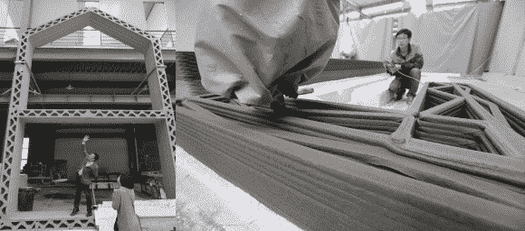

# 使用回收材料在不到 24 小时内 3D 打印房屋

> 原文：<https://hackaday.com/2014/04/26/3d-printing-homes-in-less-than-24-hours-using-recycled-materials/>

当许多 3D 打印机公司正朝着越来越小的精确打印机发展时，中国一家名为上海赢尚装饰设计工程有限公司正在试验一种巨大的 3D 打印机，其尺寸有半个奥林匹克游泳池那么大。

这台巨大的打印机长 32 米，宽 10 米，宽 6.6 米，可以打印 200 平方英尺的独立平房。打印机使用 FDM 技术，并沉积水泥和建筑垃圾的混合物来建造墙壁。据公司介绍，一套房子不到 5000 美元，打印机一天就能吐出 **10** 套房子！

这台打印机是几年前设计的，WinSun 从海外购买了零件，然后在苏州的一家工厂组装。他们计划打印这些房子的整个别墅，并开始在中国建立回收设施，收集用于打印机的材料。首个出售的房屋将位于青岛。

使用 FDM 技术，可以在水泥梁内铺设桁架支撑系统，同时减轻重量并增加强度。

[https://www.youtube.com/embed/SObzNdyRTBs?version=3&rel=1&showsearch=0&showinfo=1&iv_load_policy=1&fs=1&hl=en-US&autohide=2&wmode=transparent](https://www.youtube.com/embed/SObzNdyRTBs?version=3&rel=1&showsearch=0&showinfo=1&iv_load_policy=1&fs=1&hl=en-US&autohide=2&wmode=transparent)

这绝对比荷兰的 KamerMaker 快得多！我们预计 3D 打印运河房屋还需要 2-3 年才能建成…

【Via [BBC 新闻](http://www.bbc.com/news/blogs-news-from-elsewhere-27156775)，感谢费迪南德！]