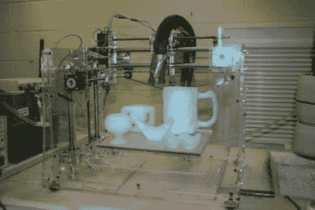

# 3d 打印冰雕

> 原文：<https://hackaday.com/2012/05/30/3d-printing-ice-sculptures/>

[Jared Kotoff]问了一个关于脸书的有趣问题。他问我们以前是否见过冰中的 3d 打印。虽然我们在我们的档案中找不到任何东西，但他设法找到了一个项目，即[制作 3d 打印冰雕](http://www.3ders.org/articles/20120103-3d-ice-printer.html)。为此，他们实际上在零下 8 华氏度的室内打印了两种材料。第一种材料是用作支架或模具的起酥油甲基酯(SME)。第二种材料只是水，但尖端被加热到 68 度，以防止它在喷嘴中冻结。他们对 SME 的每一层进行两遍水，并在每五层之后用激光扫描并进行校正。

一旦印刷完成，雕塑必须刮掉 SME，然后浸泡在煤油中去除最后的 SME。链接文章里有几张图片，但很遗憾没有视频。