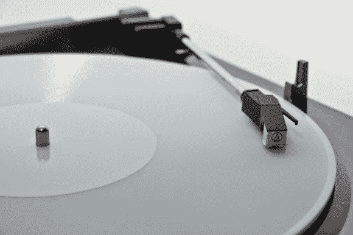

# 3D 打印记录

> 原文：<https://hackaday.com/2012/12/21/3d-printing-records/>

这是用 3D 打印机创建的工作[记录。 [阿曼达](http://www.amandaghassaei.com/ "Amanda")想出了一个将音频文件转换成 3D 模型的过程。这些模型可以打印出来，在标准的唱机上播放。

真正的工作是由创建 STL 文件的加工草图完成的。[阿曼达]开始尝试创造一个正弦波。她用这个测试来优化印刷过程。然后，她使用 Python 从 WAV 文件中提取音频数据，并修改处理脚本来处理数据。经过更多的调整，她能够得到一个合理的信噪比，并尽量减少失真。

最终记录的采样率为 11 kHz，分辨率为 5-6 位。音质不会和商业压制的黑胶一样，但你仍然可以听出这首歌。

一台 [Objet Connex 500](http://http//www.objet.com/3D-Printer/Objet_connex500/) 用于打印记录。这台 UV 打印机的分辨率为 600 dpi，这意味着它比挤压打印机更精确。使用不同的打印机，您的收获可能会有所不同，但是所有的处理和 Python 代码都可以从项目报告中获得。

休息之后，观看[阿曼达]旋转一些 3D 打印的唱片。

[//player.vimeo.com/video/56017345](//player.vimeo.com/video/56017345)