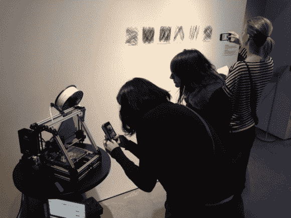

# 3D 打印一些甜美的音乐

> 原文：<https://hackaday.com/2013/04/21/3d-printing-some-sweet-music/>

如果你不介意最终得到奇怪形状的 3D 打印零件[，你可以让你的打印机给你唱歌](http://vimeo.com/63997136)。上面展示的展品就是这么做的。Lulzbot 由步进电机驱动，产生特定频率的声音。几首不同歌曲的结果就是挂在右边墙上的东西。休息之后，你可以在剪辑中听到比才的《卡门》。

[Rickard Dahlstrand]编写了一个 Python 脚本，能够解析 MIDI 文件并输出一个 g 代码等价物，它将产生在步进电机上听到音频所需的频率和持续时间。正如我们提到的，他使用了 Lulzbot，但剧本似乎包括对 Cupcake、Thingomatic、Shapercube 和 Ultimaker 的设置。可以从他的库下载解析器脚本以及古典音乐库[的 g 代码文件示例。](https://github.com/rickarddahlstrand/MIDI-to-CNC)

现在，如果你正在寻找一些其他疯狂的数控音乐想法，你不能击败这个酒杯音乐黑客。

[https://player.vimeo.com/video/63997136](https://player.vimeo.com/video/63997136)