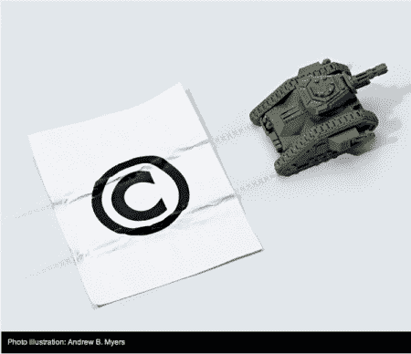

# 3d 打印，盗版的新前沿？

> 原文：<https://hackaday.com/2012/05/31/3d-printing-the-new-frontier-of-piracy/>

我们都听说过无数关于数字媒体盗版的争论。然而，似乎 3d 打印或其他快速原型系统正在将法律问题带到一个更加现实的世界。故事是这样的:[托马斯]买了一台 3d 打印机。他是战锤雕像的忠实粉丝。他花了大量的时间创建一些定制的战锤模型，并将它们上传到 thingobjector。战锤的所有者 Games Workshop 释放了律师，并移除了这些物品。

这个故事有这么多角度，令人难以置信。如果我是一名艺术家，而其他人正在上传我的作品，基本上停止了我的收入，这将是糟糕的。话又说回来，如果我足够幸运，拥有一群狂热的粉丝，带着兴奋和热情传播对我产品的热爱，我可能会鼓励他们。然而，这两种想法都没有涉及到法律问题。我们没有答案给你。抱歉。将来，您可能会越来越频繁地看到这个问题。

我们[鼓励你制作我们的标志](http://hackaday.com/2010/01/12/how-to-make-a-printable-ces-badge/)。虽然我们没有问过我们的律师。