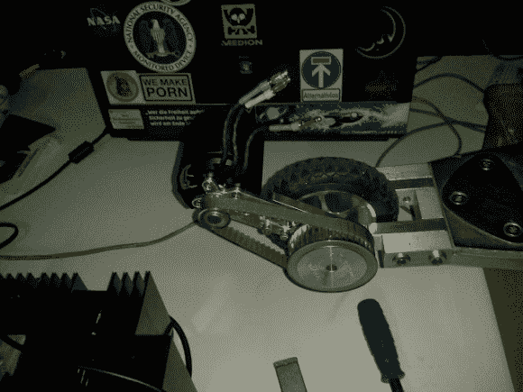

# 3kW 电动滑板车

> 原文：<https://hackaday.com/2014/01/11/3kw-electric-scooter/>

[Exco]已经考虑制造电动滑板车有一段时间了，假期过后，他决定就这么做。

类似于我们上个月分享的[电动长板](http://hackaday.com/2013/12/27/motorized-longboard/)，这款踏板车使用了一个遥控业余爱好电机——在这种情况下，一个 63 毫米 3kW 无刷 outrunner(用于遥控飞机)，加上一个 100A ESC。他从易贝廉价购买了踏板车(“踢脚板”)，并花了几天时间在机械商店对其进行改装。它现在有更好的轮子，和定制的安装马达的铝制支架。驱动系统使用带滑轨的皮带和滑轮来提供张力。

为了给它提供动力，他在易贝买了一堆 2.5Ah，18V 的脂肪包，最初是从牧田钻机组买的。然后，他挑选出细胞，移除死亡的细胞，将所有的东西焊接在一起，组成他自己的弗兰肯斯坦包来平衡它们。最终配置包含 21 个 18650 锂电池。他甚至收缩包装它，这使它看起来相对专业！

它由连接到 ESC 的按钮电位计控制。理论最高速度约为 27 公里/小时，1285 转/分钟，他们设法在一次真实的测试中达到 25 公里/小时。在[无尽的球体论坛](http://endless-sphere.com/forums/viewtopic.php?f=35&t=56030)上有更多的信息，休息之后我们为你准备了两个测试视频。

[https://www.youtube.com/embed/LRso6UsPHg0?version=3&rel=1&showsearch=0&showinfo=1&iv_load_policy=1&fs=1&hl=en-US&autohide=2&wmode=transparent](https://www.youtube.com/embed/LRso6UsPHg0?version=3&rel=1&showsearch=0&showinfo=1&iv_load_policy=1&fs=1&hl=en-US&autohide=2&wmode=transparent)

[https://www.youtube.com/embed/yXr9Mk43Utw?version=3&rel=1&showsearch=0&showinfo=1&iv_load_policy=1&fs=1&hl=en-US&autohide=2&wmode=transparent](https://www.youtube.com/embed/yXr9Mk43Utw?version=3&rel=1&showsearch=0&showinfo=1&iv_load_policy=1&fs=1&hl=en-US&autohide=2&wmode=transparent)

【谢谢 Momo！]