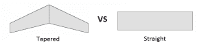

# 4 轴数控泡沫切割机配备 Unistrut 框架

> 原文：<https://hackaday.com/2014/10/06/4-axis-cnc-foam-cutter-sports-a-unistrut-frame/>

数控泡沫切割机能够切割出一些非常酷的形状，否则很难做到。他们通过将一根加热的金属丝拉过一块泡沫来实现这一点。电流通过电线加热，导致泡沫融化，没有灰尘，也没有垃圾需要清理。【batchelc】决定自己做[大型数控泡沫切割机](http://www.rcuniverse.com/magazine/article_display.cfm?article_id=1155)，一路上拍了很多照片。

由于机器是 4 轴的，这意味着两侧可以彼此独立地向前/向后和向上/向下移动，锥形形状是可能的。这将是有帮助的一个例子是切割机翼，这些机翼是后掠的或者在每一端具有不同的轮廓。

这台机器的主框架由 Unistrut 制成，尺寸高达 60×60 英寸。减去机械部件的尺寸，切割区域最终为 48×42 和 22 英寸高。泡沫位于 MDF 层上，重力是切割过程中压制泡沫的唯一方法。金属丝实际上并不接触泡沫，所以没有施加力使其移动。热金属丝移动缓慢，熔化金属丝前面几千英寸的泡沫，导致两者之间没有接触。

每侧的两轴由两侧轴承座支撑的 1/2-10”丝杠驱动。纵轴通过安装在 Unistrut 通道上的滑动轴承平稳地穿过机器的长度。垂直轴有一个塑料衬套，沿一个圆轴滑动。

机器的控制部分是一个 HobbyCC FoamPro 套件，带有 4 轴步进电机控制板和 4 个 NEMA 23 步进电机。 [GMFC](http://gm.cnc.free.fr/en/index.html) 软件用于生成 g 代码并向步进电机控制板发送命令。

[https://www.youtube.com/embed/JR83M_k4yro?version=3&rel=1&showsearch=0&showinfo=1&iv_load_policy=1&fs=1&hl=en-US&autohide=2&start=115&wmode=transparent](https://www.youtube.com/embed/JR83M_k4yro?version=3&rel=1&showsearch=0&showinfo=1&iv_load_policy=1&fs=1&hl=en-US&autohide=2&start=115&wmode=transparent)