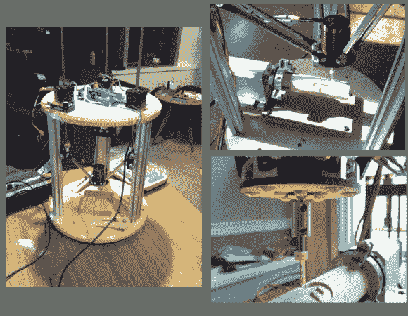

# 4 轴 Delta 路由器向世界问好

> 原文：<https://hackaday.com/2014/02/12/4-axis-delta-router-says-hello-world/>

[Bart]站在 delta 3D 打印机巨头的肩膀上，创造了这个 [4 轴 delta 路由器](http://www.buildlog.net/blog/2014/02/the-delta-router-4th-axis/)。这款路由器最初是为[曼特营](http://ordcamp.com/)设计的，这是一个只有黑客才能参加的聚会。每年他都创造一个新的东西，其主要目的是:引发对话。用他自己的话来说，“实用性和适合性是最差的，所以继续前进吧。如果你这样做，你就没有抓住重点。”

[Bart]用他的德尔塔做了一些不同的事情。对于电机，他用的是非固定步进电机。“非固定”指的是电机有一个旋转的空心螺母，而不是一个轴。丝杠(通常带有 acme 螺纹)穿过该螺母。当马达的螺母转动时，螺杆通过马达被推动或拉动，形成线性致动器。唯一的主要缺点是，非专属步进电机不能手动调节。螺丝不转动，马达的任何外部零件也不转动。对于结构，刳刨机使用 [MakerSlide](https://www.inventables.com/technologies/makerslide) 和 v 形槽轮。主轴是一个简单的无刷电机和 30 安培的速度控制。相对于我们最近看到的外置马达，[Bart]明智地选择了通常用于遥控汽车的内置马达。内燃机通常比外燃机的扭矩小，但它们在每分钟转数上弥补了这一点。[Bart 的]马达能够达到 30，000 RPM，这对于主轴负载来说已经足够了。我们认为电机轴承可能需要升级，因为原来的电机轴承不是为侧向负载设计的。作为一个控制器，[巴特]利用了一个[阿兹特格 X3](http://reprap.org/wiki/Azteeg_X3) 运行[重复](http://www.repetier.com/)。

路由器在营地表现很好，[Bart]决定它需要一个第四轴。他从易贝采购了一个旋转轴。为了保持软件简单，他将旋转轴连接到控制器上的挤出机输出。然后，他能够破解 mach3 包装的旋转后处理器，以输出挤出机命令。结果看起来很棒。[Bart]说系统肯定需要一个尾座，我们同意。我们期待着这台机器的下一次更新！

[https://www.youtube.com/embed/XwsTGyUTCiM?version=3&rel=1&showsearch=0&showinfo=1&iv_load_policy=1&fs=1&hl=en-US&autohide=2&wmode=transparent](https://www.youtube.com/embed/XwsTGyUTCiM?version=3&rel=1&showsearch=0&showinfo=1&iv_load_policy=1&fs=1&hl=en-US&autohide=2&wmode=transparent)

[https://www.youtube.com/embed/PNEJ2qN9Q3g?version=3&rel=1&showsearch=0&showinfo=1&iv_load_policy=1&fs=1&hl=en-US&autohide=2&wmode=transparent](https://www.youtube.com/embed/PNEJ2qN9Q3g?version=3&rel=1&showsearch=0&showinfo=1&iv_load_policy=1&fs=1&hl=en-US&autohide=2&wmode=transparent)