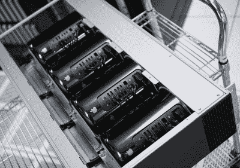
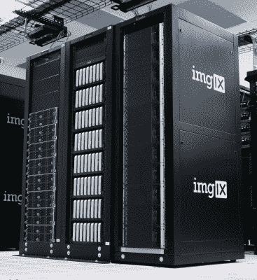

# 44 个 Mac Pros 机架可替换 64 个 Mac Minis 机架

> 原文：<https://hackaday.com/2015/07/31/44-mac-pros-racked-up-to-replace-each-rack-of-64-mac-minis/>

几天前，我们很高兴看到机架上的 96 台 MacBook Pros 作为测试硬件。这很酷，所以看到一个类似的精巧的黑客，实际上是在作为一个生产服务器使用。imgix 是一家为主要 web 平台提供图像大小调整的初创公司。这意味着他们需要一些真正的图像处理能力，最近敲定了一项设计，即[在每个机架](http://photos.imgix.com/racking-mac-pros)上安装 44 台 Mac Pro 电脑。之所以选择这种硬件，是因为它能够胜任图像处理的繁重工作。事实证明，它比它取代的 64 台 Mac Minis 更好地利用了机架空间。

## 生产用机架 Mac Pro

11 个 R2 面板中的每一个都可以容纳 4 台 Mac Pro。冷却是首要任务，因此每个面板的右侧都有一个格栅，用于吸入冷空气。这是一个密封的管道，通过它安装每个 Pro 的一侧。这使得电脑内置的排气扇可以自我冷却，吸入冷空气，从另一侧排出。

面板前面也提供了每个端口的入口。连接器安装在前面板的右侧，在此图中不在框架内。电源和以太网从机架背面引出。

这种方法的唯一缺点是，如果一台计算机坏了，你需要拉动整个机架来替换它。这代表了总机架的 9%,因此 imgix 设计了 44 节点系统来处理这种处理损失，而无需停止整个机架的维修。

## 为什么这打败了 mac mini

3 racks – Linux. Mac Min, Mac Pro

在这里，您可以看到该公司正在使用的三种不同的机架。左边是运行 Linux 的普通服务器设备。中间是 R1 设计，它使用 64 台 Mac Minis 来处理图形密集型任务。右边是新的 R2 机架，取代了 R1 的设计。

显然，每台 Mac Pro 都比 Mac Mini 更强大，但我联系了 imgix，询问是什么促使他们放弃了 R1 的设计，该设计拥有八个机架面板，每个面板上有八台 Mac Mini。生产总监西蒙·库恩(Simon Kuhn)指出，最初的机架设计是一个很好的设计，但最终一个机架的空间中的计算能力太少，没有意义。

虽然在物理上有至少两倍的 Mac Mini 单元的空间——通过将它们安装在每个空间的两个深度——但这将导致几个问题。首先是热量。将计算机的第二个位置保持在安全的工作温度范围内，如果不是不可能的话，也是具有挑战性的。第二是自动电源控制。R1 机架使用两组 48 个可控插座为计算机和冷却风扇供电。这一点很重要，因为插座允许他们远程重启运行不正常的设备。最后，更多的单元意味着需要处理更多的以太网连接。

我们很高兴看到定制服务器机架设置。如果你有自己的，或者别人制作的最爱，[请告诉我们](http://hackaday.com/submit-a-tip/)！

[感谢 drw72】在评论中提到 R2]