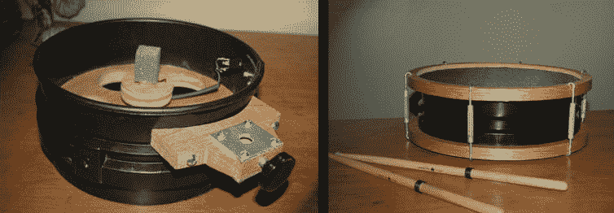

# 5 加仑 5 件装电子鼓套装

> 原文：<https://hackaday.com/2014/05/22/5-gallon-5-piece-electronic-drum-set/>

谁不想在半夜敲鼓呢？如果你有任何类似邻居的东西，那么午夜即兴表演是不可能的。除非有一套电子鼓可用…但是，唉，那些很贵。如果你口袋里没有多余的钱，那就像[Mike]和[一样，做一套完整的 5 件装电子鼓。](http://www.edrums.info/bucket_drum_1.htm)

[Mike]从 5 加仑的桶开始，这些桶将成为鼓壳。在真实的架子鼓上，所有的鼓都有不同的大小，以产生不同的音符。鼓的大小与电子鼓无关，因为鼓模块产生音符和声音。即便如此，为了让这个场景更真实一点，每个鼓都被分段并拉回到一起以改变直径。自制的圆形切割夹具和木刳刨机用于从 3/4″胶合板上切割出顶部和底部的轮辋箍。这些铁环的内径比 5 加仑桶壳的外径稍大一点。顶部铁环的底部被加工成一个凹槽，这样标准的网状鼓面就可以装在里面了。

电子鼓使用传感器来测量鼓棒敲击的力度。大多数 DIY 鼓使用压电元件(想想你 1980 年的老虎手持游戏中的蜂鸣器)。这些压电元件很便宜，甚至在当地的 Radio Shack 就能买到。由于[压电性](http://en.wikipedia.org/wiki/Piezoelectricity)，这些元件在受到力或应力(如鼓槌的冲击)时会产生电力。电压输出与力成正比。

泡沫砂块被切割下来，材料用于将能量从鼓面传递到压电元件，因为鼓槌对压电元件的直接撞击会损坏传感器。压电的输出引线直接连接到安装在鼓壳上的 1/4”音频插孔。跳线将每个鼓连接到负责产生实际声音的鼓模块。

一旦单个的鼓制作完成，迈克就做了一个木架来固定鼓。总的来说，这是一个足智多谋的构建，对于最少的钱和一点点时间来说，结果并不太差。