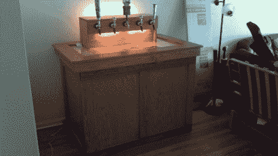

# 5 桶龙头系统正确对待您的家庭酿造

> 原文：<https://hackaday.com/2012/09/06/5-keg-tap-system-treats-your-home-brew-right/>

当你的家酿啤酒转向桶装系统时，最大的花费之一就是找到一种保持低温的方法。[Sanchmo]走了一条传统的路线，使用卧式冰箱，但一点额外的努力使这个看起来普通的设备成为他客厅里的一个 5 水龙头展示品。

家庭酿造通常以五加仑为一批，所以科尼利厄斯小桶(装苏打)非常适合。这里使用的冷藏箱有足够的空间存放五个冰箱和一罐二氧化碳。一个温度控制器([沿着这条线](http://hackaday.com/2010/11/05/chest-freezer-temperature-controller/))把冰柜变成了冰箱。但是为了让它更漂亮，[桑奇摩]对木材店下手很重。他把一张胶合板拧到盖子上，然后把它修剪掉，还有一个用来固定水龙头的塔。这是进一步强调了包括一些发光二极管的影响。

我们确实在 Reddit 的讨论中发现了一个警告词。冰箱最初的金属外壳可能被用作散热器，现在被木质镶板覆盖。我们不确定这种特定模式是否属实，但如果你想建立自己的模式，一些调查是必要的。