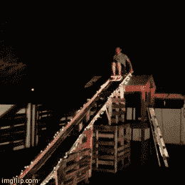

# 价值 50 美元的后院过山车

> 原文：<https://hackaday.com/2013/12/08/50-backyard-rollercoaster/>

这太棒了。当你和一群朋友打赌，他们不能在自家后院以低于 50 美元的价格建造过山车，会发生什么？他们建造了一个。

他们几乎完全用旧叉车托盘、家得宝的一些木材、各种钉子和螺丝、一些脚轮和一个旧竞技场的折叠座椅来建造它。它是由三个人用 9 个多小时建成的。组装好后，他们用 15 磅的煤渣砖进行了测试——安全第一，对吗？煤渣砖幸免于难，按照这个逻辑，一个 160 磅以上的人应该也没问题！

嗯…他们是对的！为了完成它，融入节日气氛，他们还把它装饰成圣诞灯，让邻居的孩子整夜使用。家得宝公司的木材和车轮总共花了 49.27 美元。

休息后留下来看看. GIF 文件吧！

我们去年报道过一个类似的后院过山车，它的特色是一位父亲为一个非常幸运的孩子制作的轨道的 [PVC 管道。](http://hackaday.com/2012/08/11/manpowered-pvc-rollercoaster/)

[via [Reddit](http://www.reddit.com/r/pics/comments/1sa740/guy_builds_roller_coaster_for_under_50_dollars/)