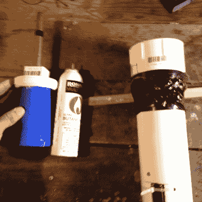
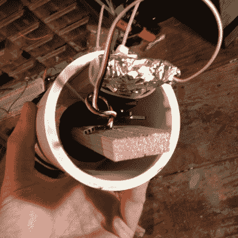
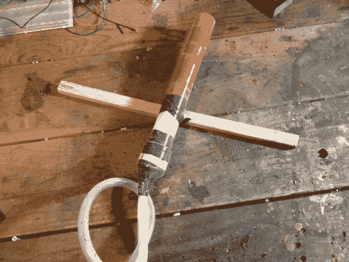

# 6 英尺高的喷火食人鱼植物来自超级马里奥兄弟

> 原文：<https://hackaday.com/2013/05/09/6-foot-tall-fire-breathing-piranha-plant-from-super-mario-brothers/>

[https://www.youtube.com/embed/NQ-rBsU7oU0?version=3&rel=1&showsearch=0&showinfo=1&iv_load_policy=1&fs=1&hl=en-US&autohide=2&wmode=transparent](https://www.youtube.com/embed/NQ-rBsU7oU0?version=3&rel=1&showsearch=0&showinfo=1&iv_load_policy=1&fs=1&hl=en-US&autohide=2&wmode=transparent)

我一直认为建造一个巨大的喷火食人鱼工厂会很酷。我从来没有真正想出这样做的借口。最终，我决定我真的不需要借口，于是它就诞生了。

植物本身几乎只是泡沫和纸板。你可以在视频中看到建设过程，这真的很容易，但有点耗时。我想看起来有点疯狂，超风格化，所以它布满了静脉，有这些看起来疯狂的皱纹嘴唇。这种植物放在家里本身就是一件有趣的事情。实际上，我可能会把它变成一盏灯。

消防系统是反复试验的结果。

我最初的计划是使用丙烷的“灭火瓶”设计，就像你在 burningman 看到的那样。我已经准备好了所有的部件，正准备建造它的时候，红牛创造挑战开始了。我最终使用了大部分零件来建造红牛大炮。

在继续讲下去之前，让我指出这不是制作壁炉架的正确方法。这些方法都不是特别安全。

我的计划后来改变了，可以在室内使用。我想要火焰，但不是巨大的火柱。为此，我在一个拼凑的分配器中使用了几小瓶丁烷。

有一大块 PVC，底部装有伺服和柱塞。帽子的顶部有一个小孔，一根长长的铜管伸出来。丁烷瓶用一个旧塑料杯导入孔中，然后整个东西拧到位。你可以看到一个小橡皮筋保持丁烷瓶被推入孔中，所以它不会掉出，只是用丁烷填充腔室。

    

当我按下按钮时，伺服系统会将瓶子向上推，将丁烷释放到铜管中。极其简单，极其有效。我真的很喜欢这个产生的火球。

当我把它展示给外面的人看时，他们的第一反应是希望有更多的火。植物本身的大小让这些小火球显得有些乏味。所以，我建立了基本相同的系统来安装一罐化油器清洁剂。同样，可怕的想法，完全不安全。

无论我如何尝试调整机械装置，碳水化合物清洁剂都不能干净地排出。高度易燃的液体喷得到处都是，包括瓶子的侧面。幸运的是，我在工厂外进行了测试。这是一个彻底的失败，我有机会使用灭火器。

我最终把食人鱼放在一边过冬，但是一旦太阳出来，我又想把它拿出来。我考虑过拆开红牛加农炮的零件，回到丙烷罐，但最终决定把它留给另一个消防项目。

我最终使用的室外消防系统总共花了大约 15 分钟。它是一个圆柱体，上面连着一根软管。你把奶精(很细的粉末，显然不是液体)放进去。一股压缩空气向上喷射，穿过你选择的火焰，形成一个滚动的火球。软管上有个结，可以防止奶精一路倒下来。我敢肯定有一百万种其他方法可以做到这一点，但这一点。

虽然构建很容易，但实现却不那么简单。我发现在很多情况下，少即是多。太多的空气压力只是在没有火的情况下到处喷洒奶油。太多的奶油会点燃，但会在着火时掉落到地上或植物上。大约 30 磅的压力和大约四分之一到半杯的奶油给了我一些很好的火球，可以轻松地上升 10 英尺。

最终，我想如果我要在活动中使用它，我可能会放入丙烷驱动的灭火器。奶精工作正常，但视频是一个烂摊子，并采取了很多设置之间的镜头。

哦对了，一定要抓住视频结尾 gopro 从四轴飞行器上掉下来的镜头。当我取回相机时，你可以看到四轴飞行器仍然在我上方的空中飞行。