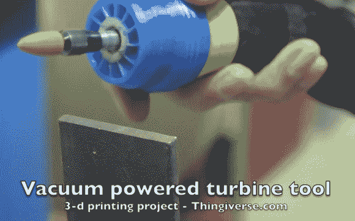

# 60，000 RPM 真空动力旋转工具是 3D 打印的

> 原文：<https://hackaday.com/2013/06/11/60000-rpm-vacuum-powered-rotary-tool-was-3d-printed/>

3D 打印气动旋转工具中涡轮的呜呜声可能会让你的牙齿疼。当[Axodus]向我们通风报信时，他提到这听起来像是一架 747 飞机在起飞。但是我们在观看演示视频时会听到牙医的钻头声。

[理查德·麦克法兰]发表了他的设计，如果你想试着为自己建造一个。但是，除了打印外壳和一对涡轮机之外，您还需要进行一些加工。工具的轴需要与轴承精确配合。它接受一个中间蓝色的间隔，两边各有一个红色的涡轮。该组件封装在两部分螺纹蓝色阀体内，该阀体有一个法兰与车间真空软管摩擦配合。加工轴的商业端被设计并加工有螺纹，以接受来自 Dremel 或类似旋转工具的夹头。

我们想知道将它重新设计成 PCB 钻床需要多少工作量？

[https://www.youtube.com/embed/SuztgGhTRg0?version=3&rel=1&showsearch=0&showinfo=1&iv_load_policy=1&fs=1&hl=en-US&autohide=2&wmode=transparent](https://www.youtube.com/embed/SuztgGhTRg0?version=3&rel=1&showsearch=0&showinfo=1&iv_load_policy=1&fs=1&hl=en-US&autohide=2&wmode=transparent)