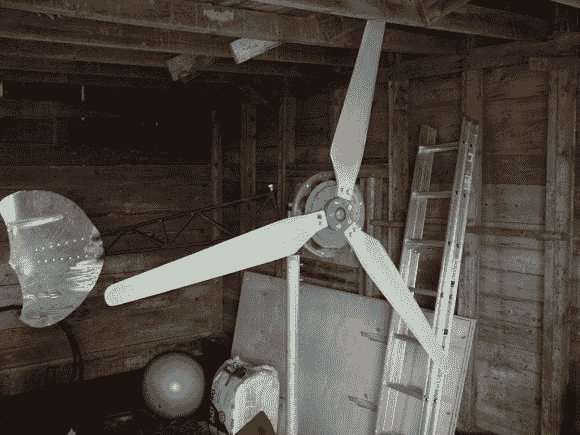

# 7 英尺 DIY 风力涡轮机证明尺寸很重要

> 原文：<https://hackaday.com/2014/02/10/7-foot-diy-wind-turbine-proves-size-matters/>

当[brokengun]决定建造一个直径 7 英尺的风力涡轮机时，他甚至不知道如何启动，所以他像我们大多数人一样，读了一些这方面的书。他的设计标准是尽可能简单地建造和使用回收部件。这个风力涡轮机给 12 伏的电池充电，然后可以用来给各种各样的设备供电。

虽然是由回收部件制成，但这不是一个扔在一起的风力涡轮机。在设计和建造上花了很多心思。[brokengun]讨论了如何将叶片尺寸与发电机的尺寸相匹配，以最大化功率和效率。该设计还结合了一个功能，如果风速过高，涡轮将垂直于风转动。这样做可以防止涡轮机被强风损坏。

对于主支撑/轮毂组件，使用了沃尔沃 340 支柱，因为它们随处可得、价格低廉且以经久耐用而闻名。尾梁由电导管制成，其长度由主风扇转子的尺寸决定。尾部叶片由钢板制成，其表面积也取决于风扇转子的尺寸，以确保涡轮机正常工作。这些刀片是由木头制成的，但是[brokengun]觉得这些刀片值得花些钱，而不是自己做。[brokengun]还拿下了一个机场正在拆除的 30 英尺高的格子塔。这个结果很好，因为对于这种尺寸的涡轮机来说，这个高度正好合适。

[https://www.youtube.com/embed/TXqXg0YrDPA?version=3&rel=1&showsearch=0&showinfo=1&iv_load_policy=1&fs=1&hl=en-US&autohide=2&wmode=transparent](https://www.youtube.com/embed/TXqXg0YrDPA?version=3&rel=1&showsearch=0&showinfo=1&iv_load_policy=1&fs=1&hl=en-US&autohide=2&wmode=transparent)

如果你喜欢 DIY 风力涡轮机，我们已经看到它们是由 55 加仑的桶、T2 PVC 管和许多其他材料制成的。