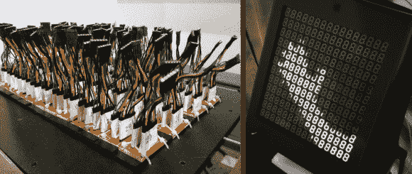

# 7 段显示矩阵不仅仅显示数字

> 原文：<https://hackaday.com/2013/11/21/7-segment-display-matrix-visualizes-more-than-numbers/>

你几乎可以看出这是一只伸出的手[，显示在一个 7 段显示器](http://labs.teehanlax.com/project/digit)的大网格上。但你必须看两遍的唯一原因是因为这是一张静态照片。当你看到下面的视频时，你所看到的就更明显了…部分原因是该设备被用作电子镜子。

显示屏上总共有 192 位数字。为了使事情变得更容易，使用了四位数的模块，尽管我们仍然忍不住向您展示组织良好的布线方案。每个模块由其自己的分立 Arduino 驱动(驱动 28 个 led，因为它们显然没有连接小数点)。所有 48 块 Arduino 板都从运行 openFrameworks 的 Raspberry Pi 接收命令来生成动画。

当然，在[彼得]发现一年多前的一个类似展示之前，这个项目已经进行得很好了。但我们很高兴，这并没有阻止他们向前迈进，甚至建立在这个想法上。他们在显示器的框架上增加了一个摄像头，让它可以反射前面的任何东西。

我们脑海中闪现的是最近参加小饰品大赛的作品之一。

[https://player.vimeo.com/video/79332227](https://player.vimeo.com/video/79332227)

[Thanks Eren]