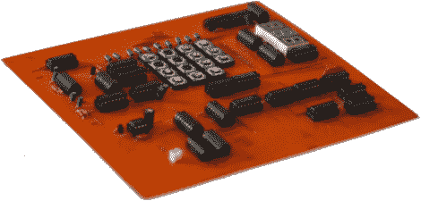

# 7400 逻辑竞赛获奖名单公布

> 原文：<https://hackaday.com/2012/11/13/7400-logic-competition-winners-announced/>

7400 逻辑大赛已经落下帷幕。[获奖者已经公布](http://dangerousprototypes.com/2012/11/09/open-7400-logic-competition-winners-2012/)而且人数不少。共有 15 个一等奖项目，9 个二等奖项目和 19 个三等奖项目。大量高质量的参赛作品证明了比赛的受欢迎程度。它有助于设立各种各样的奖项，上面链接的帖子列出了所有捐赠物品作为奖励的赞助商。

上面看到的板子被授予了读者的选择，大奖就是颁给了它。是[一个 7400 系列计算器](http://umairmukati.com/entry/7-7400digicalc)。[Umair Mukati]和[Naveed Ahmed]都是巴基斯坦卡拉奇工业电子工程学院的学生，他们开发了这个设备，作为班级项目的一部分。它能够增加或减少两位数。这包括支持负数作为结果。休息之后，我们嵌入了计算器运行的视频演示。

[https://www.youtube.com/embed/70AaNg9llmg?version=3&rel=1&showsearch=0&showinfo=1&iv_load_policy=1&fs=1&hl=en-US&autohide=2&wmode=transparent](https://www.youtube.com/embed/70AaNg9llmg?version=3&rel=1&showsearch=0&showinfo=1&iv_load_policy=1&fs=1&hl=en-US&autohide=2&wmode=transparent)

[谢谢尼克]