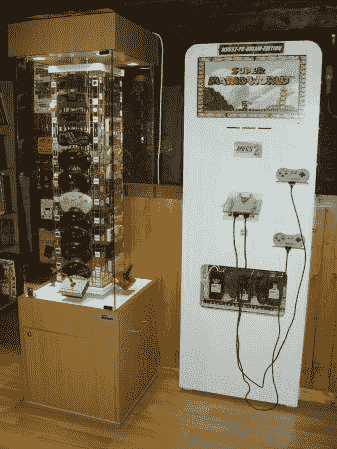
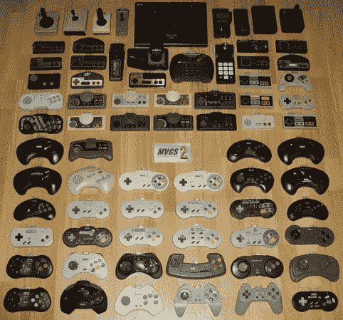

# 75 个控制器，一个游戏系统

> 原文：<https://hackaday.com/2013/08/24/75-controllers-one-gaming-system/>

这款游戏柜允许两名玩家从各种控制台中选择游戏，并使用原装控制器进行游戏。[Patrice]围绕他的[多视频游戏系统 2](https://www.facebook.com/pages/MVGS2-Multi-Video-Games-System-Two/217043908348817 "MVGS2")建造了它，它将 75 个控制器中的每一个转换成一种通用格式。玩家从展示柜中挑选控制器，插入 HD-15 连接器，然后选择他们想玩的游戏。该机柜包含一台运行各种仿真器的 PC，并使用[hyperpin](http://www.hyperspin-fe.com/ "HyperSpin")作为菜单系统。

使用适配器，转换后的控制器也可以在其他游戏系统、平板电脑或智能手机上使用。[Patrice]声称他们可以在 110 个不同的游戏系统上工作。此处显示了控制器和系统的完整列表[。](http://ultimate.arcade.pagesperso-orange.fr/fichiers5/Ensemble-Manettes-Universelles-et-Adaptateurs-MVGS2.jpg "MVGS2 Controllers")

这个柜子绝对是我们见过的最全面的视频游戏装置之一，控制器的展示柜看起来棒极了。休息之后，看看这个系统的视频和一些控制器色情。

[https://www.youtube.com/embed/qDLe0FKwgy8?version=3&rel=1&showsearch=0&showinfo=1&iv_load_policy=1&fs=1&hl=en-US&autohide=2&wmode=transparent](https://www.youtube.com/embed/qDLe0FKwgy8?version=3&rel=1&showsearch=0&showinfo=1&iv_load_policy=1&fs=1&hl=en-US&autohide=2&wmode=transparent)