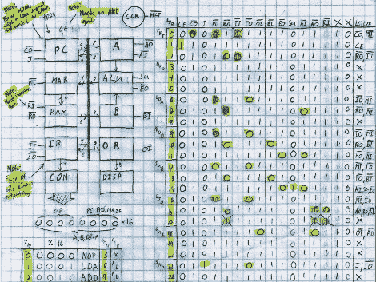

# 8 位逻辑芯片计算机构建

> 原文：<https://hackaday.com/2012/04/23/8-bit-logic-chip-computer-build/>

[凯尔]一直在努力从头开始建造一台 8 位计算机。他为各种组件使用了一套逻辑 ic，并使用一些 NVRAM 芯片来存储控制字。你在上面看到的是他的指令集的路线图。他刚刚开始将它们写入芯片，通过构建一个基于 Arduino 的程序员来简化这项工作。

我们很高兴看到[奎因·邓基]在她的基于 Z806502 的个人电脑上取得的进步，它是以非常相似的方式在试验板上开始的，但是[从那些卑微的开始已经走了很长的路](http://hackaday.com/2012/04/10/veronica-gets-vram-and-its-own-boot-logo/)。最近我们还参观了[一台使用分立元件的 4 位计算机](http://hackaday.com/2012/04/20/building-a-computer-with-discrete-transistors/)。但是[凯尔]对挑战的态度介于两者之间。

他的设计要点可以在他早期的一篇文章中找到。他有一个从清除地址寄存器开始的环形计数器。然后，它加载下一条指令的 NVRAM 地址，该指令将在后续计数中执行。看起来构建还有一段路要走，所以一定要留意更新。

[via [Reddit](http://www.reddit.com/r/electronics/comments/sjbid/a_blog_about_my_project_building_an_8bit_computer)