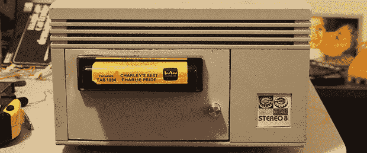

# 8 轨磁带作为存储介质

> 原文：<https://hackaday.com/2013/12/10/8-track-tapes-as-a-storage-medium/>

在[Woz]为 Apple II 创造出优雅的 Disk II 接口之前，在 Commodore 强行创造出 C64 5 1/4”驱动器之前，几乎每台家用电脑都使用盒式磁带进行存储。请注意，是盒式磁带，不是 8 轨磁带。[Alec]认为这是 20 世纪 70 年代末工程师的一个重大疏忽，所以他制造了一个 8 磁道磁带机。

这实际上并不是第一次在电脑上使用 8 声道存储数据。 [Compucolor 8001](http://oldcomputers.net/compucolor-8001.html) 有一个双外置 8 轨驱动器，而 [Exidy 巫师](http://www.retrothing.com/2009/06/exidy-sorcerer-the-8track-computer-1.html)有一个内置在“键盘就是电脑”外形中的磁带机。应该注意的是，几乎没有人听说过这两款电脑——例如，Compucolor 卖出了大约 25 台——所以我们就让它成为 8 磁道磁带机成功的证明吧。

[Alec]在旧的外部 SCSI 硬盘盘柜中安装了 8 磁道驱动器。内部是一个 Arduino，控制轨道选择，磁带插入和磁带结束信号。数据用 DTMF 和 FSK 编码进行编码，就像早期的盒式数据磁带一样。

在计算机方面，[Alec]正在使用一种简单的 UNIX 风格、基于管道的 I/O。通过在每个轨道上编码 4 位，他能够将整个字节放在两个立体声轨道上。读/写速度非常慢——从休息后的视频中，我们假设[Alec]正在以大约 100 位/秒的速度运行他的磁带机——比实际输入数据慢得多。这可能是他正在使用的 40 年前的 8 轨磁带的问题，但作为概念证明，这并不太糟糕。

[https://www.youtube.com/embed/PXI5mMZIjJs?version=3&rel=1&showsearch=0&showinfo=1&iv_load_policy=1&fs=1&hl=en-US&autohide=2&wmode=transparent](https://www.youtube.com/embed/PXI5mMZIjJs?version=3&rel=1&showsearch=0&showinfo=1&iv_load_policy=1&fs=1&hl=en-US&autohide=2&wmode=transparent)