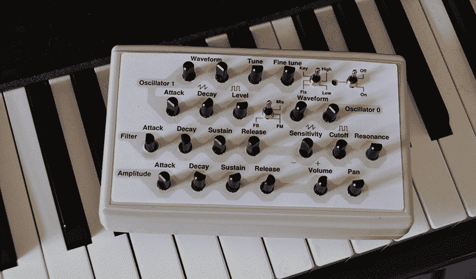

# 16 声部自制复音合成器

> 原文：<https://hackaday.com/2014/11/26/a-16-voice-homebrew-polyphonic-synth/>

自制合成器——在微控制器中生成波形，添加 MIDI 接口，并将所有内容发送到扬声器——是很好的项目，它将教会你如何利用微型低功耗 uC。[Mark] [创造了可能是我们见过的最强大的自制合成器](http://www.quinapalus.com/goom.html)，同时使用了一个相对低功耗的微控制器。

这个项目的硬件是运行在 72 MHz 的 LPC1311 ARM Cortex M3。将数字音频转换成扬声器可以理解的内容是由一个立体声 24 位 DAC[Wolfson WM 8762](http://www.wolfsonmicro.com/products/dacs/stereo-dacs/wm8762/)处理的。这两种芯片都可以以不到一英镑的价格买到，这是老式合成器中使用的芯片所不具备的。

如下图所示，前面板使用 22 个电位计和两个开关来控制波形、ADSR、滤波器、音量和声相。为了节省微控制器上的引脚，[Mark]使用了一些模拟多路复用器。至于电路，这是一个相当简单的设置，唯一真正奇怪的组件是用于 MIDI 输入的光耦合器。

synth 的软件大部分是用汇编语言编写的。在以前的版本中，大部分代码是用 C 写的，一切都慢了一倍。在汇编中进行所有的声音生成允许两倍的同时声音。

这是一个伟大的项目，与我们之前看到的其他 synth 构建相比，[Mark]的项目是同类项目中的佼佼者。对档案的快速搜索表明，这可能是我们见过的最复调的自制合成器，听项目页面上的声音样本，听起来很不错。