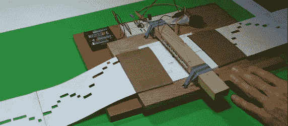

# 一架 555 型钢琴

> 原文：<https://hackaday.com/2013/06/23/a-555-player-piano/>

从简单的蜂鸣器到雅达利朋克游戏机，简单的 555 定时器芯片是许多有趣的 lo-fi synth 项目的基础，非常适合初学者。[Steven]为在初级合成器中使用 555 定时器[编写了一个很棒的教程，甚至还制作了一个简单的电子钢琴，能够从一张打孔的纸上弹奏一首歌。](http://rimstar.org/science_electronics_projects/555_timer_music_instrument.htm)

基本的 555 振荡器电路非常简单——只有几个电容和电阻，由几节电池供电。[Steven]构建了最简单的 555 电路，但使用了一条画在纸上的石墨线作为控制频率的电阻。它基本上是一个建立在试验板上的 drawdio，即使是最新手的电子修补者也很容易制作。

更进一步，[斯蒂芬]在一张纸上用铅笔石墨画了一条又长又粗的线，并在他临时制作的电阻上安装了 11 个线圈。在一张纸上剪了几个洞后，他就能用他的 555 合成器制作出一架简单的钢琴。它运行良好，足以玩绿袖，是初露头角的电子黑客的完美项目。

[https://www.youtube.com/embed/rTmlR8B-u5c?version=3&rel=1&showsearch=0&showinfo=1&iv_load_policy=1&fs=1&hl=en-US&autohide=2&wmode=transparent](https://www.youtube.com/embed/rTmlR8B-u5c?version=3&rel=1&showsearch=0&showinfo=1&iv_load_policy=1&fs=1&hl=en-US&autohide=2&wmode=transparent) [https://www.youtube.com/embed/PSQ6AqqhSgo?version=3&rel=1&showsearch=0&showinfo=1&iv_load_policy=1&fs=1&hl=en-US&autohide=2&wmode=transparent](https://www.youtube.com/embed/PSQ6AqqhSgo?version=3&rel=1&showsearch=0&showinfo=1&iv_load_policy=1&fs=1&hl=en-US&autohide=2&wmode=transparent)