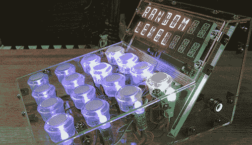

# 一场美丽的熄灯游戏

> 原文：<https://hackaday.com/2013/02/18/a-beautiful-game-of-lights-out/>

大约一年前，[安东尼]决定着手他迄今为止最大的项目。他想要一个有很多发光二极管的东西，所以当重现经典的电子关灯游戏的想法出现在脑海中时，他知道他已经具备了一个杀手级项目的素质。完成的[熄灯街机盒](http://anthonydigirolamo.github.com/blog/2013/02/13/lights-out-box/)是一件很棒的作品，有 16 个 17 段显示器和同样多的 LED 照明街机按钮。

到目前为止，[安东尼]的项目最令人印象深刻的特征是两排 17 段显示器。这些由两个 [MAX6954 LED 显示驱动器](http://www.maximintegrated.com/datasheet/index.mvp/id/3410)在一个漂亮的电线包裹板上控制。游戏的 16 个按钮是半透明的街机按钮，非常好地补充了 RGB LED 条。

然而，一个伟大的显示器和一大堆发光二极管并不能构成一个游戏。[Anthony]在 JSTOR 上看到了[这篇文章，这篇文章告诉他如何创建新的 4×4 熄灯游戏，并通过算法解决它们，以获得解决该难题所需的总移动次数。正如你在](http://www.jstor.org/discover/10.2307/2691157?uid=3739864&uid=2&uid=4&uid=3739256&sid=21101828283487)[这个视频](http://vimeo.com/59807162)中看到的，用最少的移动量解决这个难题有点难。尽管如此，我们还是要赞扬[安东尼]这个伟大的项目。