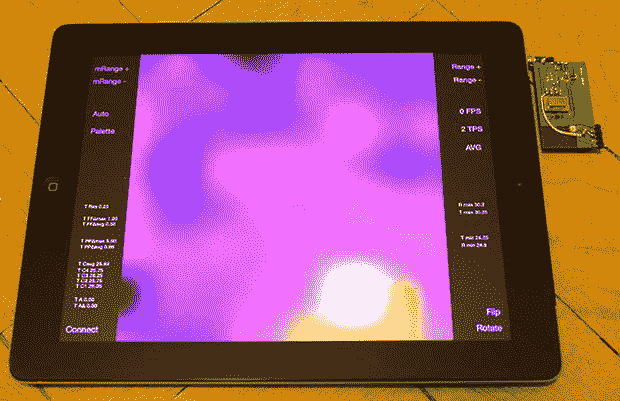

# 更好、更便宜的智能手机热像仪

> 原文：<https://hackaday.com/2014/07/24/a-better-cheaper-smartphone-thermal-imager/>

在过去的几年里，红外热成像设备的价格已经跌入谷底，从十年前的数万美元跌至一台分辨率非常高的设备仅约 1000 美元。这种价格的大幅下降是由新的传感器带来的，在非常低端，有相当多的非常便宜的低分辨率热成像设备。

现在的目标似乎是找到一些方法将这些红外设备添加到智能手机或平板电脑上。以前也有过类似的项目和 Kickstarters，但[【Marius】参加 Hackaday 奖](http://hackaday.io/project/1974)是在削弱所有这些项目，而且是以一种非常非常聪明的方式。

之前的“智能手机上的热成像仪”项目包括 [Mu 热摄像机](http://hackaday.com/2013/03/06/a-real-thermal-imaging-camera-for-300/)，这是一个 300 美元的 Kickstarter 奖励，结果是一个蒸汽软件。[IR-Blue](http://hackaday.com/2012/12/15/a-thermal-imaging-camera-for-your-phone/)是我们见过的另一个 Kickstarter，[和实际售价约为 200 美元的东西](http://www.rhworkshop.com/products/ir-blue-dm)。[Marius]希望他的热成像仪只需 99 美元。他用一点疯狂的电子产品摆脱了这个定价，实际上设计了一个最小可行的产品。

Mu 热感相机和 IR-Blue 都通过蓝牙与智能手机主机进行通信。[Marius]认为无线电模块是不必要的，并受到了[劫持系统](http://web.eecs.umich.edu/~prabal/projects/hijack/)的启发，其中低功率传感器通过耳机插孔供电和读取，意识到他可以做得更好。

总是革新者，[马里乌斯]意识到他可以改进劫持能量收集解决方案，并让一切与原型一起工作。传感器中的实际硬件基于 Omron D6T-1616L 红外阵列模块的工程样本，这是一个 16×16 红外像素阵列，以 4 FPS 的速度在便携式设备上显示热数据。

这很有意思，当然，价格是 IR-Blue 的一半，分辨率是它的四倍。即使(马里乌斯)没有赢得 Hackaday 奖，他至少有一个获胜的 Kickstarter。下面是 8×8 像素原型的视频。

* * *

 **本帖介绍的项目是[黑客大奖](http://hackaday.io/prize)中的一个参赛项目。建造一些令人敬畏的东西，赢得太空之旅或数百个其他奖品。**

* * *

[https://www.youtube.com/embed/Iw1LcJuFTm8?version=3&rel=1&showsearch=0&showinfo=1&iv_load_policy=1&fs=1&hl=en-US&autohide=2&wmode=transparent](https://www.youtube.com/embed/Iw1LcJuFTm8?version=3&rel=1&showsearch=0&showinfo=1&iv_load_policy=1&fs=1&hl=en-US&autohide=2&wmode=transparent)