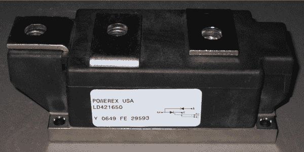
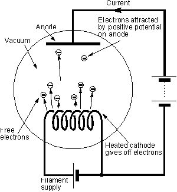
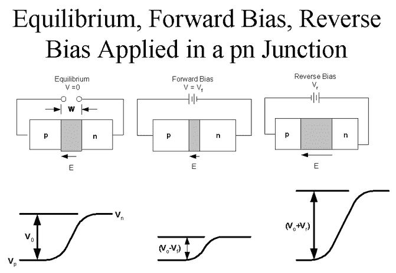

# 关于二极管的一些情况

> 原文：<https://hackaday.com/2012/05/08/a-bit-about-the-diode/>

你们大多数人已经知道什么是二极管，但是你对这个器件了解多少呢？

二极管是一种只允许电流单向通过的元件。最初，它们是通过在高真空中，将带正电的阳极板放在钨阴极的视野内而制成的。通过将阴极加热到几百度，金属的功函被降低到足以使电子仅用几伏电压就可以进入真空。这些电子会被冷的正极吸引，流进流出电子管。由于冷板的功函数比阴极的功函数高几个数量级，电流更有可能只向一个方向流动。

虽然这种热离子过程工作得非常好，非常快，但加热器的要求最终使二极管非常低效。因此，只有当几百兆赫的频率必须以非常高的功率整流时，才使用热离子二极管；在大多数应用中，它们已经被半导体二极管淘汰了。

半导体是简单的小元素。纯净时，它们是非常好的绝缘体，不会导电。不过，只要在晶格中加入一些杂质，就有可能让这些材料传导电子或空穴。通过将几个具有 5 个以上价电子的原子扔进晶格，半导体将能够传导电子，形成 N 型半导体。同样，通过扔进几个电子-几个原子，有可能传导空穴，产生 P 型材料。通过将这两种类型夹在一起，我们可以形成 PN 结；一个二极管。

当 P 半导体偏置为正，N 半导体偏置为负时，电子可以很容易地流入二极管，跳过 0.7V 的小耗尽区，继续它们的快乐旅程。但是，如果二极管偏置不正确，空穴和电子就会从结中迁移出去，形成一个非常大的耗尽区。事实上，该结变成了一个几皮法的电容，在[中，有些情况下甚至可以这样使用。](http://en.wikipedia.org/wiki/Varicap)

尽管 PN 结可能很大，但它是有损耗的小东西。虽然它们在阻止反向电流方面做得非常好，但如果要整流 20 安培的电流，它们的 0.7(现在是 0.5)伏耗尽区将很容易燃烧 14 瓦。不仅如此，二极管在反向偏置后需要很长时间才能“恢复”，从而限制了它的整流速度。1N 串联二极管通常不适用于 400Hz 以上的频率！UF 系列二极管要快得多，可以在 100kHz 下平稳工作，但任何超过 500kHz 的要求都有点过分。我想我们不能抱怨，因为他们确实把 coherers 打得落花流水！

我希望你们都喜欢这篇文章；未来，我们将关注特种二极管！