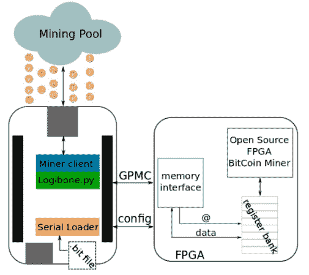

# 使用 FPGA 屏蔽的 BeagleBone 的比特币挖掘示例

> 原文：<https://hackaday.com/2013/02/22/a-bitcoin-mining-example-for-the-beaglebone-with-an-fpga-shield/>

如果你有一个 BeagleBone 和一个 FPGA 板，你应该[试试这个比特币采矿设备](http://valentfx.com/logi-blog/item/fpga-logi-family-bitcoin-mining-application)。硬件使用蛮力来求解哈希，寻找可以用作数字货币的稀有集合。这个特殊的例子是为 LOGi-bone 设计的，LOGi-bone 是 BeagleBone 的 FPGA 屏蔽。但是我们看不到任何会使它难以与其他 FPGA 硬件一起使用的东西。

我们过去见过 [FPGA 硬件比特币挖矿](http://hackaday.com/2011/08/22/fpga-bitcoin-miner-is-probably-the-most-power-efficient/)。它不像[的 GPU 阵列](http://hackaday.com/2012/12/06/25-gpus-brute-force-348-billion-hashes-per-second-to-crack-your-passwords/)提供那么大的马力，但是 ARM/FPGA 组合可以在集群中使用，以加快处理速度。这听起来像是在本地黑客空间进行的一个有趣的团队项目。