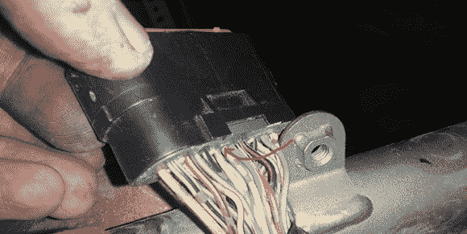

# 摩托车的黑盒子

> 原文：<https://hackaday.com/2013/06/02/a-black-box-for-a-motorcycle/>

[Lukusz]有一辆新的摩托车——雅马哈 XJ6SA——由于它还没有出过事故，他认为建造一个黑匣子来记录骑行最后 30 分钟的遥测数据将是一个好主意。虽然[项目](http://www.iwasz.pl/electronics/motorcycle-black-box-part-1-data-acquisition-with-arduino-mega/)尚未完成，但他已经在读取直接来自引擎控制单元的数据。

在弄清楚了他自行车的 ECU 连接器的大部分引出线后，[Lukasz]发现了一根实际上没有任何作用的电线。这是他的 ECU 的 k 线，一个串行输出，能够中继仪表的状态到外部设备。虽然 k 线的电子规格有点奇怪，但幸运的是在[找到一个芯片](http://www.st.com/web/catalog/sense_power/FM1965/SC377/PF75181)将信号转换成逻辑分析仪可以理解的东西之后。

通过将逻辑分析仪连接到 k 线上，并将其设置为以 16064 波特接收，Lukasz 能够直接从他的自行车上获得大量数据。未来，他计划将速度、指示灯、每分钟转数和当前档位等数据传递给 Raspberry Pi 进行记录。