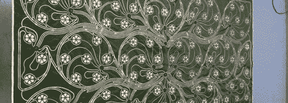

# 检测自身方向的毯子

> 原文：<https://hackaday.com/2012/04/24/a-blanket-that-detects-its-own-orientation/>

如果你想捕捉一个物理对象的 3D 模型，你可以使用 Kinect、几束激光、建设性的光，甚至是安装在机械臂上的简单触摸传感器。这些都是昂贵的设备，而且有些不必要，因为你可以把毯子盖在物体上，然后立刻得到一个 3D 模型。

这个项目被称为 IM BLANKY，它应该通过简单地将它扔在一个物体上来复制 3D 形状。花卉图案中的花瓣是导电织物，用作每朵花中心带电流苏的触点。当毯子被扔在一个物体上时，流苏会受到重力的作用，与六个导电花瓣中的一个接触，并向微控制器发送倾斜开关。

虽然我们不太确定 IM BLANKY 仅通过 20 个倾斜传感器提供的分辨率，但我们想象这可以用于一些医疗应用。

经由[设备](http://dvice.com/archives/2012/04/forget-your-snu.php)