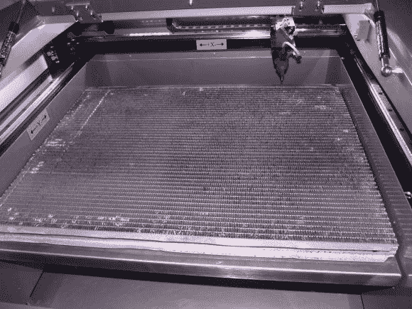

# 一个廉价的蜂窝表取代你的激光

> 原文：<https://hackaday.com/2014/02/22/a-cheap-honeycomb-table-replacement-for-your-laser/>

二氧化碳激光器利用了一个蜂窝工作台，它可以让你支撑你正在切割的零件，而不会切入床身太多。不幸的是，它们是一个消耗品，所以它们最终会磨损，而且它们并不便宜。[哗众取宠]想出了一个极好的替代方案。

几个月前，他的旅行车散热器爆了，必须更换。他正要把它扔掉，这时他意识到散热器的散热片和他的蜂窝桌的散热片很相似……他把它切割成一定的尺寸，用压力清洗(尽管他指出你可能应该在切割前先清洗)，然后把它放好。很好用！

我们唯一的警告是，你可能应该先用水泵冲洗散热器——你不想加热散热器通道内任何残留的散热器液体吧！

没有激光，没有问题——看看开源的 [axCut diy 激光！](http://hackaday.com/2014/01/16/axcut-an-open-source-laser-cutter/)感觉更加雄心勃勃？[自己做 CO2 激光管](http://hackaday.com/2012/06/07/incredible-home-made-low-cost-co2-laser/)怎么样？