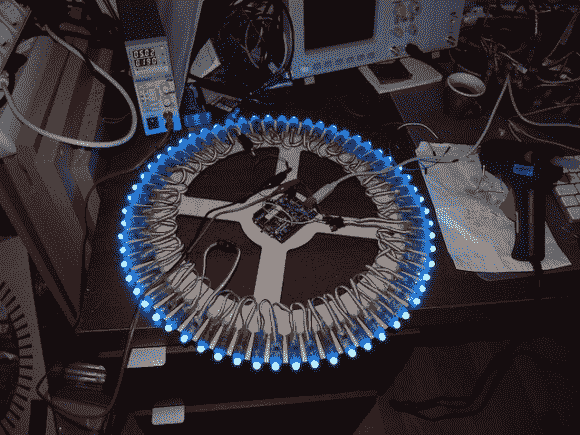

# 使用 60 个 RGB 像素的时钟

> 原文：<https://hackaday.com/2013/03/13/a-clock-that-uses-sixty-rgb-pixels/>

这个项目的灵感来自一件高度抛光的艺术品。[Tobias]一直在研究他自己的 [RGB LED 时钟，它在一个小时的每一分钟使用一盏灯](http://tobiscorner.floery.net/rgb-pixel-clock-part-4/)。在看到[春分钟](http://hackaday.com/2010/09/07/equinox-clock/)后，他受到启发开始了这个项目。这一款为每个 LED 使用了一个小 PCB，并包括一个丙烯酸挡板和每个灯的扩散器。随着 LED 像素串的出现，为自己组装一个已经变得相当容易了。

该项目的关键部分是激光切割胶合板框架，每个手指之间有一个手指，以完美地分隔灯光。每个像素都被热粘在适当的位置，驱动它们的 Arduino 板位于框架的中心。这些灯非常亮，所以[Tobias]还包括一个光敏电阻，允许系统测量环境光，并相应地调节像素亮度。

他的项目帖子有四个部分，所以要确保你花些时间四处点击，以获得所有的细节。