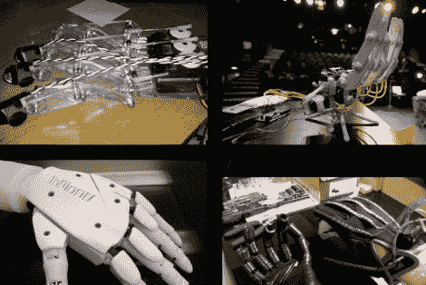

# 一组手来激发你的万圣节电子动画

> 原文：<https://hackaday.com/2012/10/29/a-collection-of-hands-to-inspire-your-halloween-animatronics/>

跳跃惊吓很有趣，但是如果你想吸引所有那些不给糖就捣蛋的人的注意力，我们建议你用一个令人毛骨悚然的道具。在这一类别中，最好的选择之一是一只栩栩如生的手。你可以从 Adafruit 组装的机器人手的综述中获得一些灵感。

我们为上面的图片选择了四个例子，但是还有更多的例子。在左上角有一个激光切割的丙烯酸手，实际上在指尖上有一些力敏电阻，以帮助实现一些触觉反馈。这个项目的灵感来自右下角看到的手，它使用手套上的柔性传感器来控制机器人的运动。如果你在寻找更真实的东西，左下角的 3D 打印部件是最好的选择。但是，如果你想在万圣节之夜之前把一些东西放在一起，右上角的产品就是你要去的地方。它是用纸板模板切割出塑料部件，然后用多晶型形成接头和支架。