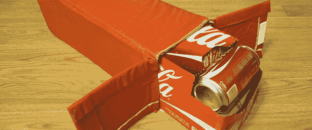

# 定制的冷却器，不需要缝纫

> 原文：<https://hackaday.com/2013/07/10/a-custom-cooler-sewing-not-required/>

当你今年夏天去海滩或野营时，注意一下你是如何打包你的冷藏箱的。你的饮料本来是装在盒子里的，但你却把它们拿出来放在一个更大的隔热盒子里。[Jason]认为给一箱汽水(或者其他饮料，我们假设)添加保温材料是一个好主意，于是[最终制作了一个定制的汽水冷却器](http://www.instructables.com/id/Custom-Soda-Cooler/?ALLSTEPS)。

这种冷却器的制造实际上非常简单。一层柔性泡沫夹在两层防水乙烯基之间，中间有喷胶。在描绘出一个图案后，[Jason]然后将这种织物切割成小块，然后将它们粘在一起，放入一个汽水盒大小的冷却器中。简单、优雅，甚至连没有带回家 ec 的黑客也能在几个小时内完成。

顺便说一句，我们在 Hackaday 似乎经常忘记织物、泡沫和纸这些“更软”的材料。这并不意味着我们回避这些项目；我的工作台正上方有一台勉强称得上是战后 Singer 15 的缝纫机。[如果你有这样的小窍门，请给我们发个小贴士](http://hackaday.com/contact-hack-a-day/)。我们很想看看。

下面的构建视频。

[https://www.youtube.com/embed/LTx6Q9JmwTI?version=3&rel=1&showsearch=0&showinfo=1&iv_load_policy=1&fs=1&hl=en-US&autohide=2&wmode=transparent](https://www.youtube.com/embed/LTx6Q9JmwTI?version=3&rel=1&showsearch=0&showinfo=1&iv_load_policy=1&fs=1&hl=en-US&autohide=2&wmode=transparent)