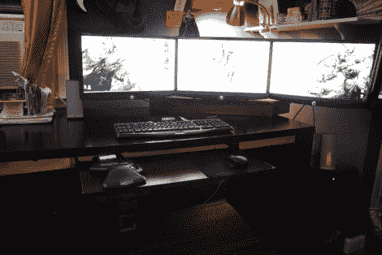

# 由木头制成的定制显示器支架

> 原文：<https://hackaday.com/2012/08/12/a-custom-monitor-mount-built-from-wood/>

[LuckyNumbrKevin]想要一个自己的大型显示器阵列，但没有足够的桌面空间来实现它。他的解决方案是[建造一个占地面积相对较小的三台电脑显示器安装架](http://imgur.com/a/RgmPg)。

设计从使用 SketchUp 的一些虚拟测试构建开始。一旦他拨进来，他就开始把底座的尺寸转移到一些胶合板上。其余的部分是用立体木材制成的。随着项目的成型，他用一些装饰包裹胶合板的边缘，并对其进行了良好的打磨。经过几次深色染色后，他准备安装从新蛋公司买来的显示器。

[Kevin]在 Reddit 帖子中留下了一条关于他设计的零件成本的评论。包括显示器在内，这个不到 300 美元。这还不包括能够驱动三者的 Nvidia 显卡。